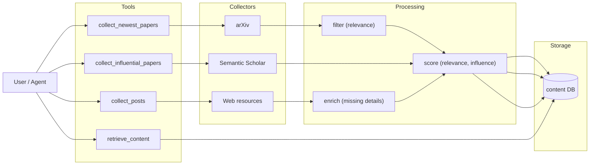

## mourat constitution spec

### 1. Executive summary

#### 1.1 Project description 

`mourat` is a flexible set of tools helping a researcher to collect research-relevant information from two types of sources: papers and posts on the Internet. We call these "quants" of information *content items*. `mourat`'s input is research questions (if we talk about pure research) or technical challenges (if we talk about industrial research). Using them, `mourat` should be able to find relevant content items in both retrospective (what are the most influential papers related to topic X?) and up-to-date (what are the most recent papers related to topic X?) modes. Its tools should be suitable for both human beings (just as runnable scripts) and AI agents (as tools).

#### 1.2 Project motivation

Information collection is the most tedious yet absolutely necessary step in many research workflow. `mourat` aims to automate this step addressing both retrospective and up-to-date information collection.

### 2. Requirement analysis

#### 2.1 Functional requirements

In the requirements above, we always assume the research questions and the technical challenges to be specified by a user. Each research question and technical challenge has its own relevance attributes by which one can estimate how relevant a given content item is.

We also assume that we have a table of research topics specified by a user where each topic is associated with one or more research questions or technical challenges.

Each content item must be relevant to at least one of the research questions or technical challenges and at least one research topic. For each related research question, technical challenge and research topic, each content item should have filled relevance attributes and a relevance score. Each content item should also have influence score (either estimated if we talk about a fresh content item or factual).

1. Collect the newest papers from arXiv and prune by relevance.
2. Collect the most influential papers for a specific research question, technical challenge or a more narrow topic.
3. Collect the newest posts from one of the specified web resources and find details if they are missing in the posts.
4. Have the content item database where the content items found by the collection tools can be saved by request. It should support retrieval by keywords, relevant research questions, relevant technical challenges and relevant research topics.
5. Provide tools to keep the paper/post database up to date in the sense of their relation to the research questions, technical challenges or more narrow topics.

#### 2.2 Non-functional requirements

1. **Collection performance**: less than one hour to process 2000 raw (unfiltered) content items.
2. **Retrieval performance**: less than one minute to search over 5000 content items.
3. **Usability**: everything should be easy for a human to read so rely on lightweight file-based databases.
4. **Interface**: all the tools should be easy to use directly from the command line and as a tool in an agent harness.

### 3. Acceptance criteria

- **FR1 (collect newest arXiv papers, prune by relevance):** e2e test running the collection pipeline on a small batch of known papers, verifying that irrelevant papers are filtered out and relevant ones are retained with correct relevance scores.
- **FR2 (collect influential papers for a topic/RQ/TC):** e2e test querying a known topic, verifying that returned papers match expected influential works.
- **FR3 (collect newest posts from web resources, enrich missing details):** e2e test against a known set of posts, verifying that enrichment fills in missing details correctly.
- **FR4 (content item database with retrieval):** tests for CRUD operations and retrieval by keywords, research questions, technical challenges, and research topics. FR5 (incremental database updates) is covered by these same tests.
- **NFR1 (collection performance <1h for 2000 items):** benchmark test measuring end-to-end processing time on a 2000-item batch.
- **NFR2 (retrieval performance <1min for 5000 items):** benchmark test measuring search time over a 5000-item database.
- **NFR3 (file-based, human-readable):** validated manually.
- **NFR4 (CLI + agent tool interface):** validated manually.

### 4. Insight

Two alternative approaches were considered:

**Idea 1: Monolithic pipeline.** A single orchestrator script that hardcodes the full flow (collect → score → filter → store → retrieve). Simple to implement initially, but adding new data sources, changing scoring strategies, or exposing individual steps as separate tools would require refactoring the core logic each time.

**Idea 2: Modular Hydra-based architecture.** Each component (collector, scorer, filter, database, retriever) is an independent, Hydra-configurable module. New sources and strategies are added via config and small modules without touching the pipeline core. Individual modules can be invoked as standalone CLI commands or composed as tools in an agent harness.

**Choice: Idea 2.** The requirements explicitly demand flexibility (multiple sources, retrospective and up-to-date modes, human + agent usage). A modular architecture satisfies this by design — the current codebase already follows this pattern with separate Hydra configs for each component. Agent harness integration will be handled via a thin tool registry that maps typed agent calls to Hydra configs behind the scenes, keeping CLI scripts clean for human use. This approach scales cleanly as new sources or scoring methods are added.

### 5. Overall solution design

#### 5.1 High-level design

#### 5.2 Core components

- **Collectors** — modules for fetching raw content from sources (arXiv, Semantic Scholar, web resources). Each is independently configurable via Hydra.
- **Scorer** — relevance and influence scoring modules (LLM-based or heuristic). Configurable per collection task.
- **Filter** — relevance-based filtering to prune collected items before storage.
- **Enricher** — fills in missing details for web-sourced posts.
- **Content database** — storage with retrieval by keywords, research questions, technical challenges, and topics.
- **Tool registry** — thin layer mapping typed agent calls to Hydra-configured modules, enabling agent harness integration while keeping CLI scripts clean for human use.
- **CLI scripts** — standalone entry points for each major operation, usable directly from the command line.

### 6. Implementation plan

#### 6.1 Todo list

1. **[DONE] Refactor existing scripts into modular components** — decouple collectors, scorers, filters, and database logic into independently configurable Hydra modules. Ensure each script uses the new module structure.
2. **Build content database layer** — implement file-based storage with retrieval API supporting queries by keywords, research questions, technical challenges, and topics.
3. **Build collect_posts with enricher** - implement a new script based on `print_reddit_summary.py` to collect posts and enrich them with details found on the Web.
4. **Implement tool registry** — create the thin wrapper layer that maps typed agent calls to Hydra-configured modules for agent harness integration.
5. **Add e2e tests** — write end-to-end tests covering full collection pipelines for each source (arXiv, Semantic Scholar, web), retrieval, and database updates.
6. **Add benchmark tests** — implement performance tests for collection (2000 items < 1h) and retrieval (5000 items < 1min).
7. **Validate CLI usability** — ensure all scripts are clean, documented, and usable directly from the command line by a human.
