## Refactor existing scripts into modular components

### 1. Executive summary

#### 1.1 Spec description 

Decouple the monolithic `pipeline.py` into independently configurable Hydra modules: collectors (arXiv, Semantic Scholar), classifiers, scorers, assigners, and shared data models. Each module lives in its own file within a clear package structure, with Hydra configs organized per-component. Create all CLI scripts required by the constitution spec: `collect_newest_papers`, `collect_influential_papers`, `collect_posts`, `retrieve_content`, and `update_database`. Scripts compose pipeline stages from the new modular structure.

#### 1.2 Spec motivation

The current `pipeline.py` (743 lines) bundles collectors, classifiers, assigners, data models, and scoring logic together. This makes it impossible to reuse individual components without pulling in unrelated code, and adding a new collector or scoring strategy requires editing a shared file. Modularity enables independent extension and clean Hydra composition.

#### 1.3 Implementation repos

- `mourat` (single repo — both management and implementation)

### 2. Requirement analysis

#### 2.1 Functional requirements

1. **Independent collectors** — arXiv, Semantic Scholar, and web collectors must be independently importable, configurable via Hydra, and usable without pulling in unrelated pipeline stages.
2. **Shared data models** — all data models (`PaperInfo`, `ScoredPaperInfo`, `AssignedPaperInfo`, etc.) must be extracted to a shared module so other components can reference them without importing pipeline logic.
3. **Independent processing modules** — binary classifiers, scorers, and assigners must each be their own Hydra-configurable module with a clear input/output contract.
4. **CLI scripts** — all five scripts required by the constitution spec must exist and work: `collect_newest_papers`, `collect_influential_papers`, `collect_posts`, `retrieve_content`, and `update_database`. Note: `retrieve_content` and `update_database` are implemented as stubs (placeholder entry points with minimal output) because the storage layer (constitution spec task 2) is not yet implemented. They must become functional once the database layer is added.
5. **Monitoring handler** — must remain independently configurable and usable by any pipeline stage.

#### 2.2 Non-functional requirements

1. **Independent testability** — each module must be unit-testable in isolation without requiring the full pipeline.
2. **No circular imports** — package structure must form a clean DAG (data models → base classes → concrete modules → scripts).
3. **Config organization** — Hydra configs must be organized per-component in subdirectories matching the module structure.

### 3. Acceptance criteria

- **FR1 (independent collectors):** Each collector is importable without pulling in unrelated modules. Verified by importing `from mourat.collectors.arxiv import ArxivPaperCollector` and `from mourat.collectors.semantic_scholar import SemanticScholarPaperCollector` in isolation (no import errors for missing scorers, assigners, etc.).
- **FR2 (shared data models):** Data models are importable from a dedicated module. Verified by importing `from mourat.data_models import PaperInfo, ScoredPaperInfo, AssignedPaperInfo` without importing pipeline logic.
- **FR3 (independent processing modules):** Each processing module (classifier, scorer, assigner, query generator, topic assessor) is independently instantiable via Hydra with a component-specific config.
- **FR4 (CLI scripts):** All 5 scripts exist and run: `collect_newest_papers`, `collect_influential_papers`, `collect_posts` execute successfully with a test config; `retrieve_content` and `update_database` exit cleanly as stubs.
- **FR5 (monitoring handler):** `MonitoringViaMarkdownFiles` is instantiable via Hydra independently of any pipeline stage.
- **NFR1 (testability):** Each module passes unit tests with mocked dependencies (HTTP client, LLM model, monitoring handler).
- **NFR2 (no circular imports):** `python -c "import mourat"` succeeds; no import cycle errors.
- **NFR3 (config organization):** Hydra configs are organized in subdirectories matching the module structure, and each script resolves its config via the new paths.

### 4. Insight

The approach is described in detail in section 5 (Overall solution design).

### 5. Overall solution design

#### 5.1 High-level design

```mermaid
graph TB
    subgraph DataModels["mourat.data_models"]
        MI["PaperInfo, ScoredPaperInfo,\nAssignedPaperInfo, etc."]
    end

    subgraph Base["mourat.base"]
        Func["Function[InputT, OutputT]\n(abstract pipeline stage)"]
    end

    subgraph Collectors["mourat.collectors"]
        Arxiv["ArxivPaperCollector"]
        SS["SemanticScholarPaperCollector"]
    end

    subgraph Classifiers["mourat.classifiers"]
        BC["BinaryPaperClassifier"]
    end

    subgraph Scorers["mourat.scorers"]
        PS["PaperScorer"]
    end

    subgraph Assigners["mourat.assigners"]
        PA["PaperAssigner"]
    end

    subgraph Filters["mourat.filters"]
        SF["ScoreBasedPaperFilter"]
    end

    subgraph Generators["mourat.generators"]
        QG["QueryGeneratorViaLlm"]
    end

    subgraph Assessors["mourat.assessors"]
        CTA["CandidateTopicAssessor"]
    end

    subgraph Monitoring["mourat.monitoring"]
        MH["MonitoringHandler\n(abstract)"]
        MvMD["MonitoringViaMarkdownFiles"]
    end

    subgraph Scripts["mourat.scripts"]
        CNew["collect_newest_papers"]
        CInf["collect_influential_papers"]
        CPosts["collect_posts"]
        GQueries["generate_queries"]
        ATopic["assess_candidate_topic"]
        RContent["retrieve_content (stub)"]
        UDB["update_database (stub)"]
    end

    MI -.-> Func
    MI -.-> Arxiv & SS & BC & PS & PA & QG & CTA & SF
    Func -.-> Arxiv & SS & BC & PS & PA & QG & CTA & SF
    MH -.-> Func & MvMD

    CNew --> Arxiv
    CInf --> SS
    CPosts --> SS
    GQueries --> QG
    ATopic --> CTA
```

#### 5.2 Core components

- **`mourat.data_models`** — shared data models extracted from `pipeline.py`: `PaperInfo`, `ScoredPaperInfo`, `AssignedPaperInfo`, `PaperInfoCollection`, `ScoredPaperInfoCollection`, `AssignedPaperInfoCollection`, `QueryInfo`, `PaperScoredByAgent`, `ListOfTopics`, `BusinessProductInfo`, `CandidateTopicInfo`, `CandidateTopicRelevanceInfo`, `CandidateTopicAssessment`.
- **`mourat.base`** — abstract base class: `Function[InputT, OutputT]` (pipeline stage contract).
- **`mourat.collectors.arxiv`** — `ArxivPaperCollector` with newest/most_relevant modes.
- **`mourat.collectors.semantic_scholar`** — `SemanticScholarPaperCollector` with newest/most_relevant/most_influential modes.
- **`mourat.classifiers`** — `BinaryPaperClassifier`.
- **`mourat.scorers`** — `PaperScorer`.
- **`mourat.assigners`** — `PaperAssigner`.
- **`mourat.filters`** — `ScoreBasedPaperFilter`.
- **`mourat.generators`** — `QueryGeneratorViaLlm`.
- **`mourat.assessors`** — `CandidateTopicAssessor`.
- **`mourat.monitoring`** — `MonitoringHandler` (abstract) and `MonitoringViaMarkdownFiles`.
- **`mourat.utils`** — shared utilities (`get_project_path`, `get_config_path`, `normalize_author_name`, `to_text_description`).
- **`mourat.scripts`** — CLI entry points: `collect_newest_papers`, `collect_influential_papers`, `collect_posts`, `generate_queries`, `assess_candidate_topic`, `print_reddit_summary`, plus new stubs `retrieve_content` and `update_database`.

### 6. Implementation plan

#### 6.1 Todo list

1. **Extract shared data models** — move all Pydantic models from `pipeline.py` into `mourat/data_models.py`.
2. **Extract base classes** — move `Function[InputT, OutputT]` into `mourat/base.py`; move `MonitoringHandler` stays in `mourat/monitoring.py` but remove its abstract decorator from the class-level (it's already there).
3. **Extract collectors** — split `ArxivPaperCollector` into `mourat/collectors/arxiv.py` and `SemanticScholarPaperCollector` into `mourat/collectors/semantic_scholar.py`.
4. **Extract classifiers, scorers, assigners, filters, generators, assessors** — move each into its own module under `mourat/` (`classifiers.py`, `scorers.py`, `assigners.py`, `filters.py`, `generators.py`, `assessors.py`).
5. **Create package `__init__` files** — set up `mourat/collectors/__init__.py` and any other subpackage inits needed.
6. **Update Hydra config paths** — reorganize configs under `config/` to match the new module structure (collector configs under `config/collector/`, etc.).
7. **Update all script imports** — point each script in `mourat/scripts/` to the new module locations.
8. **Delete `pipeline.py`** — remove the monolithic file once all classes have been moved.
9. **Create stub scripts** — `retrieve_content.py` and `update_database.py` as placeholder entry points.
10. **Write tests** — create `tests/` with:
    - Unit tests: each collector/processor module tested with mocked HTTP client, LLM model, and monitoring handler.
    - Script smoke tests: each CLI script runs with a minimal config (stubs exit cleanly).
11. **Verify** — run all existing scripts with their configs to confirm behavioral parity; run `pytest` to verify all tests pass.

#### 6.2 Modification summary

| File | Action |
|------|--------|
| `mourat/pipeline.py` | Deleted: all classes moved to new modules |
| `mourat/data_models.py` | New: all Pydantic data models |
| `mourat/base.py` | New: `Function` abstract base class |
| `mourat/collectors/__init__.py` | New |
| `mourat/collectors/arxiv.py` | New: `ArxivPaperCollector` |
| `mourat/collectors/semantic_scholar.py` | New: `SemanticScholarPaperCollector` |
| `mourat/classifiers.py` | New: `BinaryPaperClassifier` |
| `mourat/scorers.py` | New: `PaperScorer` |
| `mourat/assigners.py` | New: `PaperAssigner` |
| `mourat/filters.py` | New: `ScoreBasedPaperFilter` |
| `mourat/generators.py` | New: `QueryGeneratorViaLlm` |
| `mourat/assessors.py` | New: `CandidateTopicAssessor` |
| `mourat/monitoring.py` | Modified: keep `MonitoringHandler` and `MonitoringViaMarkdownFiles` |
| `mourat/utils/common.py` | Modified: add `to_text_description` moved from `pipeline.py` |
| `mourat/scripts/*.py` | Modified: update imports to new module locations |
| `mourat/scripts/retrieve_content.py` | New: stub script |
| `mourat/scripts/update_database.py` | New: stub script |
| `config/` | Modified: reorganize paths to match new module structure |
| `tests/` | New: test suite (import checks, unit tests, smoke tests) |
| `pytest.ini` | New: pytest configuration |
