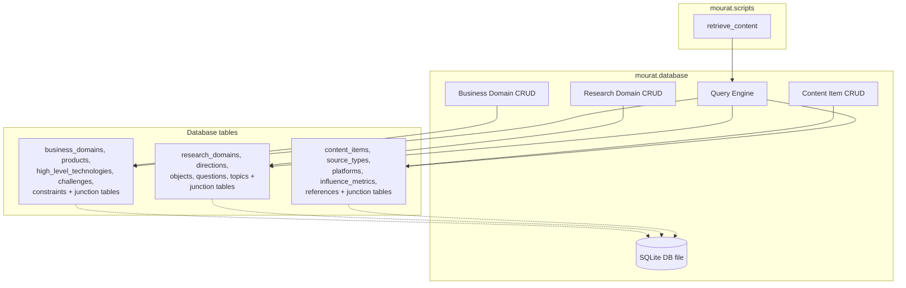
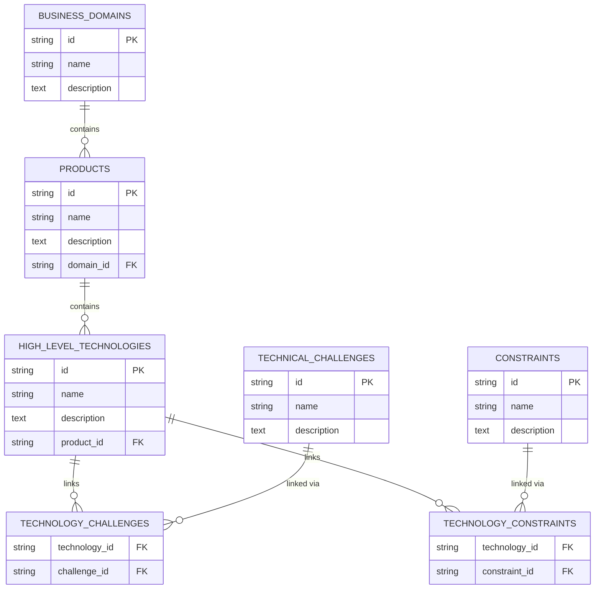
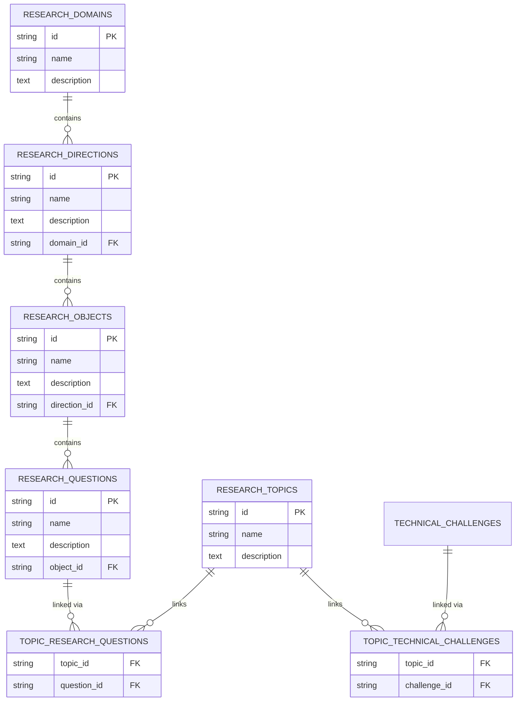
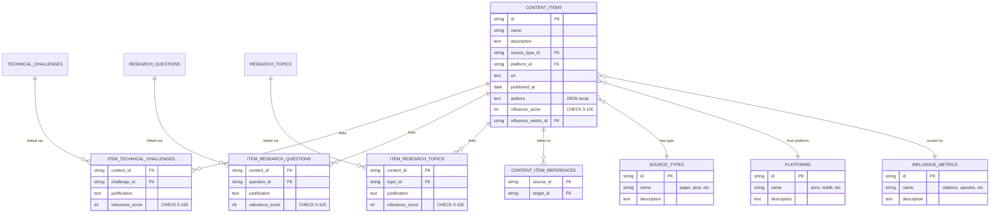

## Build content database layer

### 1. Executive summary

#### 1.1 Spec description 

Implement a file-based content database for `mourat` with a retrieval API. The database stores three hierarchies of records:

1. **Business domains** — domains, products, high-level technologies, technical challenges, and constraints with their relationships.
2. **Research domains** — domains, directions, objects, research questions, and research topics with their relationships and cross-links to technical challenges and research questions.
3. **Content items** — unified records covering both papers and posts, each carrying multiple relevance scores and attributes (one per related research question, technical challenge, and research topic).

The retrieval API supports querying content items by keywords, research questions, technical challenges, and research topics. The database also provides CRUD operations for managing all three hierarchies. The `retrieve_content` CLI script will use this layer — currently implemented as a stub — to search the database.

#### 1.2 Spec motivation

The constitution spec requires a persistent content item database with retrieval capabilities. Currently all scripts produce output to the console or markdown files with no persistence between runs. Without a database layer, researchers cannot accumulate, search, or incrementally update their collected papers and posts across sessions.

#### 1.3 Implementation repos

- `mourat` (single repo — both management and implementation)

### 2. Requirement analysis

#### 2.1 Functional requirements

1. **Content item CRUD** — create, read, update, and delete `ContentItem` records in the database. Each item supports multiple relevance scores and attributes, one per related research question, technical challenge, and research topic.
2. **Research metadata CRUD** — create, read, update, and delete research domains, directions, objects, questions, and topics, as well as business domains, products, high-level technologies, technical challenges, and constraints. Each entity has a unique identifier, name, description, and optional relationships (e.g., topic → RQs, topic → TCs).
3. **Content retrieval** — query content items by keywords (full-text search over title/abstract/text), by research question, by technical challenge, and by research topic. Results should be filterable by relevance score threshold.

#### 2.2 Non-functional requirements

1. **File-based persistence** — the database stores data on disk in a file-based format. The database can be loaded from disk into memory and written back.
2. **Retrieval performance** — search over 5000 content items completes in under one minute.
3. **Human accessibility** — information in the storage should be relatively easy for a human to read and understand, though not necessarily directly inspectable or editable as raw files.
4. **Atomic writes** — database writes should not corrupt existing data if interrupted mid-write.

### 3. Acceptance criteria

- **FR1 (content item CRUD):** Unit tests verifying create, read, update, and delete of `ContentItem` records, including items with multiple relevance scores (one per RQ, TC, and topic).
- **FR2 (research metadata CRUD):** Unit tests for create, read, update, and delete of research domains, directions, objects, questions, and topics, as well as business domains, products, high-level technologies, technical challenges, and constraints. Includes relationship queries (e.g., "list all RQs for topic X", "list all TCs for a high-level technology").
- **FR3 (content retrieval):** Tests verifying three retrieval scenarios: (1) full-text search by a non-trivial keyword query (e.g., `abc AND qwe*`); (2) retrieval by research attributes (research questions, technical challenges, and topics); (3) retrieval by score attributes (relevance scores and influence scores), with optional threshold filtering.
- **NFR1 (file-based persistence):** Test verifying that a database written to disk can be reloaded with all data intact.
- **NFR2 (retrieval performance):** Benchmark test populating 5000 items and measuring query time; must complete in under one minute.
- **NFR3 (human accessibility):** Manual verification that stored data can be read and understood by a human using a simple viewer or decoder.
- **NFR4 (atomic writes):** Manual verification that interrupted writes do not corrupt the database (tested by simulating write interruption and checking file integrity).

### 4. Insight

Two alternative approaches for the file-based storage were considered:

**Idea 1: SQLite with FTS5.** Use SQLite's built-in full-text search (FTS5) for keyword queries. Content items and research metadata stored as relational tables with joins for multi-relevance-score tracking. Atomic writes via SQLite's journal mechanism. Zero external dependencies beyond Python's stdlib `sqlite3`.

**Idea 2: JSONL files with in-memory indexing.** Store content items and metadata as individual JSONL files. Build in-memory indexes (inverted index for keywords, hash maps for attributes) on load. Full-text search implemented via regex/string matching. Simple to implement but limited search expressiveness, slower retrieval at scale, and no built-in atomicity.

**Choice: Idea 1.** The NFR2 (retrieval <1min for 5000 items) and FR3 (non-trivial keyword queries like `abc AND qwe*`) favor SQLite's indexed search over manual in-memory filtering. FTS5 provides boolean search operators out of the box. SQLite also guarantees atomicity via its journal/WAL mechanism, satisfying NFR4 without extra work.

### 5. Overall solution design

#### 5.1 High-level design

#### 5.2 Core components

- **`mourat.database`** — core database module providing:
  - **Business domain CRUD** — manage `business_domains`, `products`, `high_level_technologies`, `technical_challenges`, `constraints` with relationship support.
  - **Research domain CRUD** — manage `research_domains`, `research_directions`, `research_objects`, `research_questions`, `research_topics` with relationship support and topic-to-challenge/topic-to-question links.
  - **Content item CRUD** — manage `content_items` with `source_types`, `platforms`, `influence_metrics`, `content_item_references`, and multi-relevance-score junction tables.
  - **Query engine** — full-text search via SQLite FTS5, retrieval by research attributes (RQs, TCs, topics), retrieval by score attributes (relevance and influence scores) with threshold filtering.
- **`mourat.scripts.retrieve_content`** — CLI script (replacing the current stub) that loads the database and queries content items based on user-provided filters.

#### 5.3 Business domain hierarchy schema

#### 5.4 Research hierarchy schema

#### 5.5 Content item schema

### 6. Implementation plan

#### 6.1 Todo list

1. **Design and create the SQLite schema** — write `CREATE TABLE` DDL for all tables (business domains, research domains, content items, lookup tables, junction tables) with `CHECK` constraints and FTS5 virtual tables. Store schema in `mourat/database/schema.sql`.
2. **Implement database initialization and connection layer** — create `mourat/database/__init__.py` with functions to create/open the SQLite database file and apply the schema if it doesn't exist.
3. **Implement business domain CRUD** — `mourat/database/business_domain.py` with create, read, update, delete for domains, products, technologies, challenges, constraints, and junction tables.
4. **Implement research domain CRUD** — `mourat/database/research_domain.py` with create, read, update, delete for research domains, directions, objects, questions, topics, and junction tables.
5. **Implement content item CRUD** — `mourat/database/content_item.py` with create, read, update, delete for content items, source types, platforms, influence metrics, references, and relevance score junction tables.
6. **Implement query engine** — `mourat/database/query_engine.py` with:
   - Full-text search via FTS5 (supporting boolean operators like `abc AND qwe*`).
   - Retrieval by research attributes (RQs, TCs, topics).
   - Retrieval by score attributes (relevance and influence scores with threshold filtering).
7. **Implement `mourat.data_models`** — Pydantic models for all database entities (`ContentItem`, `ResearchQuestion`, `TechnicalChallenge`, `ResearchTopic`, etc.).
8. **Implement `retrieve_content` script** — replace the current stub with a functional CLI that accepts query parameters and displays results.
9. **Write tests** — unit tests for CRUD operations, query engine scenarios, and schema integrity.

#### 6.2 Modification summary

| File | Action |
|------|--------|
| `mourat/database/__init__.py` | New: database initialization and connection |
| `mourat/database/schema.sql` | New: full SQLite schema DDL |
| `mourat/database/business_domain.py` | New: business domain CRUD |
| `mourat/database/research_domain.py` | New: research domain CRUD |
| `mourat/database/content_item.py` | New: content item CRUD |
| `mourat/database/query_engine.py` | New: query engine with FTS5 |
| `mourat/data_models.py` | Modified: add database entity models |
| `mourat/scripts/retrieve_content.py` | Modified: replace stub with functional script |
| `mourat/scripts/update_database.py` | Deleted: no longer needed |
| `tests/test_database.py` | New: database tests |
| `tests/test_query_engine.py` | New: query engine tests |
