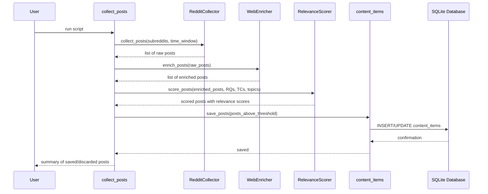

## Collect posts with enricher

### 1. Executive summary

#### 1.1 Spec description 

Implement a `collect_posts` script that collects posts from web resources (e.g., Reddit), enriches them with missing details found on the Web, and saves them to the content database. The script replaces the current `print_reddit_summary.py` which only prints summaries without persisting anything.

#### 1.2 Spec motivation

The constitution spec requires collecting posts from web resources and enriching missing details (FR3). Currently `print_reddit_summary.py` only displays an LLM-generated summary to the console — it does not save individual posts to the database, does not enrich posts with external information, and does not produce `ContentItem` records with relevance scores.

#### 1.3 Implementation repos

- `mourat` (single repo)

### 2. Requirement analysis

#### 2.1 Functional requirements

1. **Post collection** — fetch recent posts from configured web resources (e.g., Reddit via PRAW). Each post captures title, text, author, URL, date, and engagement metrics.
2. **Post enrichment** — for posts with missing or incomplete details (e.g., link-only posts with no body text), an LLM decides whether and how to enrich each post. The enrichment tools available to the LLM are URL extraction (following the link and extracting article content) and web search (finding related details online).
3. **Relevance scoring** — score each enriched post against configured research questions, technical challenges, and research topics using an LLM. Posts below a relevance threshold are discarded.
4. **Database persistence** — save only posts that pass the relevance threshold as `ContentItem` records in the content database with source type `post`, platform, influence score, and relevance scores per RQ, TC, and topic.
5. **Configurable sources** — support multiple web resources via Hydra config. Start with Reddit, extensible to Hacker News, blogs, and other sources.

#### 2.2 Non-functional requirements

1. **Collection performance**: process 2000 raw posts in under one hour (per constitution NFR1).
2. **Config-driven**: all parameters (subreddits, time window, enrichment settings, relevance threshold) come from Hydra config, not hardcoded.
3. **Idempotent**: running the script twice does not create duplicate content items.

### 3. Acceptance criteria

- **FR1 (post collection):** Unit test verifying posts are fetched from configured subreddits within the time window, with correct fields populated. Mock PRAW responses for deterministic testing.
- **FR2 (post enrichment):** Unit test verifying that an LLM agent can use enrichment tools (URL extraction, web search) to fill missing post details. Mock HTTP requests and LLM responses.
- **FR3 (relevance scoring):** Unit test verifying that enriched posts are scored against RQs/TCs/topics and filtered by threshold. Mock LLM responses for deterministic testing.
- **FR4 (database persistence):** Integration test verifying that posts passing the threshold are saved to the database as `ContentItem` records with correct source type, platform, and metadata.
- **FR5 (configurable sources):** Manual verification that collector modules can be added via Hydra config without modifying the script.
- **NFR1 (collection performance):** Manual measurement of end-to-end processing time on a batch of posts; must complete 2000 items in under one hour.
- **NFR2 (config-driven):** Manual verification that all parameters are configurable via Hydra and none are hardcoded.
- **NFR3 (idempotent):** Test verifying that running the collector twice with the same input does not create duplicate items (existing items are updated instead).

### 4. Insight

#### 4.1 Pipeline architecture

**Idea 1: Two-phase batch pipeline (Collect → Enrich → Score → Save).** Collect all raw posts in one pass. Batch-enrich posts that need missing details. Batch-score all enriched posts against RQs/TCs/topics. Save only passing posts to the database. This approach is robust: failures in one phase don't prevent the rest of the batch from processing, and it supports idempotency naturally (the database check on the next run skips already-saved posts).

**Idea 2: Single-pass per-post processing.** For each post fetched: enrich it (if needed), score it, and save it before moving to the next. Simpler to implement but slower due to sequential network/LLM calls, and harder to recover from partial failures (a crash mid-batch leaves a mix of saved and unsaved posts).

**Choice: Idea 1.** More efficient (can batch HTTP requests, reuse LLM connections), aligns with the modular architecture, and supports idempotency more naturally.

#### 4.2 URL extraction tools

**Idea A: trafilatura.** A Python library optimized for extracting main article content from web pages. Handles boilerplate removal, navigation elements, and ads automatically.

Pros: robust out-of-the-box for most news/blog sites, handles encoding well, actively maintained.
Cons: struggles with JavaScript-rendered pages, may fail on heavily structured sites (e.g., forums).

**Idea B: BeautifulSoup + requests.** Manual HTML parsing with full control over what gets extracted.

Pros: complete flexibility, can handle any HTML structure with custom selectors.
Cons: requires per-site configuration for optimal results, more fragile when target sites change their layout, no built-in boilerplate removal.

**Choice: Idea A (trafilatura).** The use case is enriching web posts — most targets are blog posts, articles, or forum threads where trafilatura performs well. The simplicity of a single library with no per-site config outweighs the edge cases.

#### 4.3 Web search tools

**Idea A: DuckDuckGo Search API (duckduckgo-search package).** Free, no API key required, returns search results with titles, URLs, and snippets.

Pros: zero setup, no cost, no rate-limit concerns for moderate usage.
Cons: less reliable than paid alternatives, results quality varies, can be rate-limited under heavy use.

**Idea B: Tavily Search API.** Purpose-built for AI agents, returns clean search results with full content snippets and source scoring.

Pros: optimized for LLM use cases, higher quality results, reliable, supports follow-up searches.
Cons: requires API key, paid beyond free tier.

**Idea C: SearXNG.** Self-hostable, open-source metasearch engine that aggregates results from dozens of providers.

Pros: no per-search cost, configurable, respects privacy, aggregates multiple search engines.
Cons: requires running/maintaining a SearXNG instance, adds infrastructure complexity.

**Choice: Idea A (DuckDuckGo).** The use case is supplementing missing post details, which typically requires only 1-2 targeted searches per post. DuckDuckGo handles this well without requiring API keys or external infrastructure. If search quality proves insufficient, Tavily can be added as an alternative config option later.

#### 4.4 Agent implementation

Three alternatives for creating the LLM enrichment agent:

**Idea A: pydantic-ai Agent with tools.** Use pydantic-ai's `Agent` class with `@tool`-decorated functions for URL extraction and web search. This is the existing pattern in the codebase (`print_reddit_summary.py` already uses pydantic-ai). Type-safe, supports tool calling natively, integrates well with hydra via `hydra.utils.instantiate()`.

Pros: consistent with existing codebase, well-tested, structured output support, clean tool registration.
Cons: adds a dependency, agent abstraction may hide some low-level details (e.g., exact API call format, retry behavior).

**Idea B: Raw LLM API calls with manual tool loop.** Call the LLM API directly (via OpenAI/Anthropic client), parse tool calls from the response, execute tools, feed results back. No agent framework.

Pros: full transparency into the API call chain, no dependency on agent framework, easier to debug at the HTTP level.
Cons: significant boilerplate (conversation state management, tool call parsing, error recovery, retries), harder to maintain.

**Idea C: Custom lightweight agent wrapper.** Build a minimal agent abstraction in `mourat` that wraps LLM calls and tool execution without the full pydantic-ai overhead. A simple loop: prompt → LLM → parse tools → execute → repeat.

Pros: project-specific, no external agent dependency, tailored to our exact needs.
Cons: reinventing what pydantic-ai already does, more maintenance burden, likely to converge to pydantic-ai's feature set over time.

**Choice: Idea A (pydantic-ai).** Already in the codebase, the team is familiar with it, and the enrichment agent pattern (tools + structured prompts) maps directly to pydantic-ai's design. No point building a custom wrapper when the existing one works.

### 5. Overall solution design

#### 5.1 High-level design

#### 5.2 Core components

- **`mourat.collectors.reddit_collector`** — fetches posts from configured subreddits via PRAW. Returns list of raw post dicts.
- **`mourat.enrichers.web_enricher`** — pydantic-ai `Agent` equipped with two `@tool`-decorated functions: URL extraction (trafilatura) and web search (DuckDuckGo). The LLM inspects each post and calls tools as needed to fill missing details.
- **`mourat.processors.post_scorer`** — scores each enriched post against RQs/TCs/topics using an LLM via pydantic-ai. Returns relevance scores and justifications.
- **`mourat.scripts.collect_posts`** — new CLI script orchestrating the full pipeline: collect → enrich → score → save to database. Replaces `print_reddit_summary.py`.

### 6. Implementation plan

#### 6.1 Todo list

1. **Create `mourat.collectors.reddit_collector.py`** — extract post collection logic from `print_reddit_summary.py` into a reusable module. Accepts subreddit list and time window, returns raw post dicts.
2. **Create `mourat.enrichers.web_enricher.py`** — pydantic-ai `Agent` with two `@tool` functions: `extract_url` (trafilatura) and `web_search` (duckduckgo-search). Accepts raw posts, returns enriched posts.
3. **Create `mourat.processors.post_scorer.py`** — pydantic-ai agent scoring enriched posts against RQs/TCs/topics. Returns relevance scores and justifications.
4. **Create `mourat.scripts.collect_posts.py`** — new CLI script orchestrating the pipeline: collect → enrich → score → save passing posts to the content database.
5. **Create `config/config_collect_posts.yaml`** — Hydra config with enrichment settings, scoring config, db_path, and relevance threshold. References `config/collector/reddit.yaml` via `defaults`.
6. **Create `config/collector/reddit.yaml`** — Reddit-specific Hydra config (subreddits, time window, PRAW settings).
7. **Write tests** — unit tests for collector (mocked PRAW), enricher (mocked HTTP), scorer (mocked LLM), and integration test for database persistence.
8. **Deprecate `print_reddit_summary.py`** — add deprecation notice pointing users to `collect_posts`.

#### 6.2 Modification summary

| File | Action |
|------|--------|
| `mourat/collectors/reddit_collector.py` | New: Reddit post collection module |
| `mourat/enrichers/web_enricher.py` | New: LLM-powered enrichment agent |
| `mourat/processors/post_scorer.py` | New: relevance scoring module |
| `mourat/scripts/collect_posts.py` | New: pipeline orchestration script |
| `config/config_collect_posts.yaml` | New: Hydra config for collect_posts |
| `config/collector/reddit.yaml` | New: Reddit-specific Hydra config |
| `mourat/scripts/print_reddit_summary.py` | Modified: add deprecation notice |
| `tests/test_collectors.py` | Modified: add Reddit collector tests |
| `tests/test_enrichers.py` | New: web enricher tests |
| `tests/test_database.py` | Modified: add post persistence integration test |
