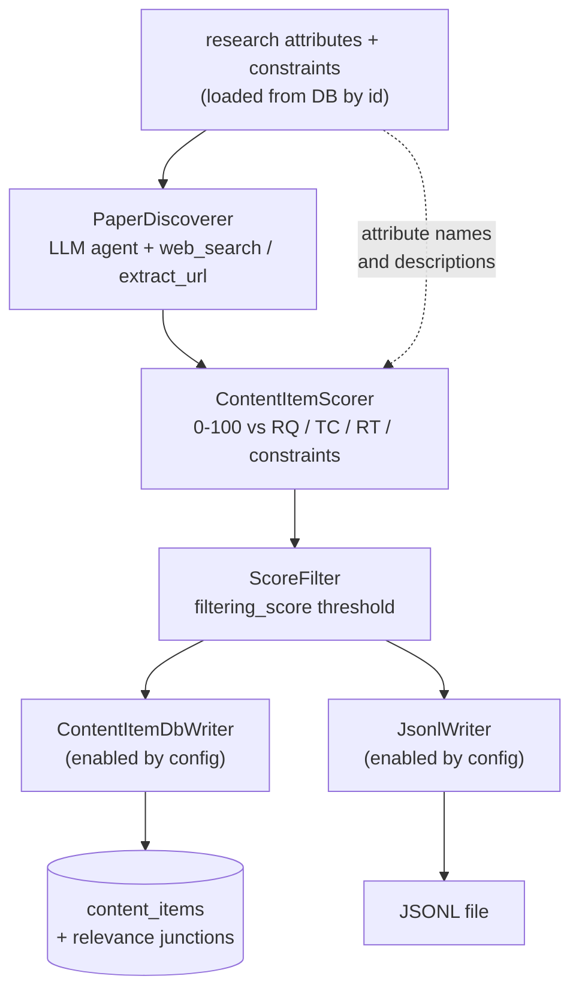

## Influential paper collection from scratch

### 1. Executive summary

#### 1.1 Spec description

The unusable `collect_recent_influential_papers` script is replaced by
`collect_influential_papers_from_scratch`, which takes a technical challenge, a research question
or a research topic — optionally conditioned on constraints — loaded from the database by id, and
discovers the most influential papers on it using web search as its primary instrument, with no
prior knowledge in the database. Discovery is driven by an LLM agent that returns each paper as a
bibliographic description: a title, the authors it found, a short description of the paper drawn
from what it read, and the urls it encountered. Papers are scored 0-100 against every supplied
research attribute with a justification per score, filtered by a configurable threshold, and
written to the content database, to a JSONL file, or to both.

A paper's url is recorded exactly as the discovery agent encountered it, and its influence score
is left unset. Deriving canonical bibliographic metadata, a verified download url and a normalised
influence value from a discovered paper is a separate concern and is not part of this spec; both
are recorded as the agent reported them or not at all, and neither is used to filter papers here.

#### 1.2 Spec motivation

Retrospective paper collection (constitution FR2) is currently unusable: its only collector
targets the Semantic Scholar API, which answers `403 Forbidden` to unauthenticated requests and
for which no API key is available, and the pipeline ends holding results in a local variable
(`collect_recent_influential_papers.py:62`) without ever reaching the database. Beyond restoring
the capability, a single keyword query against one API is a poor instrument for finding
influential work — it depends on the researcher already knowing the right search terms, which is
precisely what is unknown at the start of a literature review.

Establishing the end-to-end path — attributes in, papers out, stored — is deliberately the first
step, because the riskiest unknown in the whole feature is whether an agent equipped with web
search can find influential papers at all. Answering that against a real research question is
worth more than any amount of mechanical metadata work built on an unproven premise.

#### 1.3 Implementation repos

- `mourat` (this repo) — the discovery component, the generalised scorer and filter, the two
  writers, the script, configs and tests.

### 2. Requirement analysis

#### 2.1 Functional requirements

1. **Research attribute input** — the script accepts, via Hydra config, the database ids of one
   or more technical challenges, research questions or research topics, and optionally of
   constraints, and loads their names and descriptions from the database at startup. No research
   attribute text is hardcoded in a config file. An id absent from the database is reported
   rather than silently ignored.
2. **Discovery by web search** — candidate papers are discovered by an LLM agent equipped with
   web search and url extraction, receiving the research attribute descriptions and the
   constraints. The agent returns each candidate as a bibliographic description: a claimed title,
   the authors it found, a short description of the paper drawn from the pages it read, and the
   urls it encountered. The agent is the authority on *which* papers are worth collecting and on
   nothing else: any identifier it emits is discarded, and a url it reports is recorded
   as-encountered without being treated as a verified download link.
3. **Relevance scoring** — discovered papers are scored 0-100 against each supplied research
   question, technical challenge, research topic and constraint by an LLM, with a justification
   per score, and filtered by a configurable threshold. Unlike post collection, constraint scores
   do contribute to the score used for filtering: constraints are supplied to this script
   deliberately and per input, so a paper that satisfies none of them is not a wanted result.
4. **Persistence and file output** — the run's output destinations are selected by config:
   database persistence and JSONL file output are enabled independently, so either, both or
   neither may run. Database persistence stores papers passing the threshold as content items
   with their url, per-attribute relevance scores and justifications, leaving the influence score
   unset; re-running the script must update the relevance links of an already-stored paper rather
   than skipping it. JSONL output writes one paper per line, replicating the content item
   attributes together with their relevance scores and justifications, so a run can be inspected
   without a database. Each destination is a pipeline stage, so a write failure is logged, timed
   and reported like any other stage rather than passing silently.

#### 2.2 Non-functional requirements

1. **No credentialed API dependency**: no component on the default path requires an API key
   beyond the LLM credentials already configured.
2. **Bounded external cost**: the discovery agent's tool use is bounded by a configurable usage
   limit, so an under-specified research attribute cannot cause unbounded searching.
3. **Idempotent**: running the script twice over the same input does not create duplicate content
   items.
4. **Config-driven, with observable provenance**: all thresholds, budgets, limits and output paths
   come from Hydra config; no hardcoded values in code. Monitoring records, per paper, its scores
   and justifications and the reason any paper was dropped. Logging follows the pattern
   established by post collection: stdlib `logging` with a per-module logger, no configuration in
   library code, step timings emitted by `Function.__call__`, per-item DEBUG timings inside the
   scoring loop with external-request time separated from LLM time, ERROR for a paper dropped
   after failed LLM validation and WARNING for a fail-open case.

### 3. Acceptance criteria

Unit tests mock all external I/O: LLM behaviour via `FunctionModel` when a test must script
per-item responses and `TestModel` otherwise (as in `tests/test_enrichers.py`), and web search and
url extraction via the agent's tool functions replaced with stubs. No test performs a real network
request; database tests run against a temporary database with the schema applied.

- **FR1 (research attribute input):** test that the script resolves configured ids against a
  temporary database and passes the loaded names and descriptions to the scorer; test that an id
  absent from the database is reported rather than silently ignored.
- **FR2 (discovery by web search):** test that the discovery agent is offered the web search and
  url extraction tools; test that a scripted agent response is parsed into candidates carrying
  title, authors, description and urls; test that an identifier appearing in the agent's output
  does not reach the stored or written record; test that a url the agent reported is carried
  through as-encountered rather than dropped or rewritten.
- **FR3 (relevance scoring):** test that a paper is scored against every supplied research
  question, technical challenge, research topic and constraint; test that scores carrying ids not
  supplied to the scorer are discarded; test that a constraint score does contribute to the
  filtering score while the same component configured for post collection excludes it — one test
  instantiating both configurations, so the divergence cannot drift; test that a paper below the
  threshold is dropped and one above it is kept.
- **FR4 (persistence and file output):** integration test against a temporary database verifying
  that passing papers are stored as content items with their url and per-attribute relevance
  links, and that `influence_score` is left unset; test that a second run over the same paper
  updates its relevance links instead of leaving them stale; test that a JSONL file is written
  whose every line parses and carries the content item attributes with relevance scores and
  justifications; test each destination enabled independently, including both at once and neither;
  test that a failing write surfaces as a stage failure rather than being silently swallowed.
- **NFR1 (no credentialed API dependency):** manual verification that the script runs to
  completion with no API credentials configured beyond the LLM.
- **NFR2 (bounded external cost):** test that the discovery agent's tool use is bounded by its
  configured usage limits, and that the tool-call guard returns its refusal message rather than
  raising when the budget is reached.
- **NFR3 (idempotent):** covered by the FR4 second-run test, asserting no duplicate content item
  is created.
- **NFR4 (config-driven, with observable provenance):** test composing the script's config and
  asserting every component instantiates; test that monitoring text for the filter stage names the
  dropped papers with their scores. Manual verification of the log file for step timings and of
  config reachability for thresholds, limits and paths.

### 4. Insight

#### 4.1 Relevance scorer

**Idea A: generalise the existing post scorer over an item-agnostic input.** `PostScorer` already
scores 0-100 against research questions, technical challenges, topics and constraints, validates
returned ids against the supplied set, and produces a justification per score. It is generalised to
accept a title, a body text and optional context points, so papers and posts share one
implementation, and renamed to reflect that it is no longer post-specific.

Pros: one scoring implementation, one prompt to tune, one 0-100 scale across content types; a
paper's description maps naturally onto the body text it already expects; future scoring changes
land once.
Cons: touching a component the working post pipeline depends on, so its existing tests must keep
passing unchanged.

**Idea B: a separate paper relevance scorer.** A new component mirroring `PostScorer`'s shape for
papers.

Pros: no risk to the post pipeline.
Cons: permanently duplicates the prompt, the id validation and the score aggregation. It also
entrenches the existing scale divergence — `PaperScorer` (`scorers.py:24`) already scores papers
0-5 against a single config-string topic, and adding a third scorer would leave three scoring
components disagreeing about what a score means.

**Choice: Idea A.** The two scorers differ only in how the item is rendered into the prompt; the
scale, the entity handling and the output shape are identical. Duplicating that to avoid touching a
tested component trades a one-off risk, covered by the existing tests, for a permanent maintenance
cost. FR3's constraint rule differs from post collection, so the constraint contribution becomes a
constructor parameter rather than a hardcoded rule — which is what makes one component serve both
paths.

#### 4.2 Where the output stage lives

**Idea A: writers as pipeline stages.** Database persistence and JSONL output are each a `Function`
subclass that takes the scored collection, writes, and returns its input unchanged.

Pros: the most failure-prone step in the pipeline gains step timings, monitoring output and the
`try/except: logger.exception; raise` funnel that `Function.__call__` provides to every other
stage; passing the input through makes the two destinations independent and composable, so FR4's
"either, both or neither" needs no branching.
Cons: two more components and two more config group files than a plain function needs.

**Idea B: a module-level save function, as in post collection.** `collect_posts.py` calls
`save_posts_to_db(conn, filtered_posts)` directly.

Pros: less code; matches the existing script.
Cons: it is the pattern that lets a run persist nothing while appearing to succeed.
`save_posts_to_db` (`collect_posts.py:25-102`) sits outside the step timings, outside the
monitoring channel and outside the exception funnel, and contains eight
`except Exception: pass`/`continue` blocks. It also forces FR4's two destinations into an either/or
fork rather than two independent flags.

**Choice: Idea A.** The requirement that a write failure be reported like any other stage failure
cannot be satisfied by a function the pipeline machinery never sees. The extra components are the
price of the write being observable, which is precisely the property the existing script lacks.

#### 4.3 What the agent is trusted for

**Idea A: the agent returns bibliographic descriptions; identifiers are discarded.** The agent
emits title, authors, a description and the urls it saw. Any DOI or arXiv id it produces is
dropped.

Pros: an agent cannot poison the database with a plausible-looking but wrong identifier; what is
stored is either something a human can check by reading it (title, description) or something
explicitly marked as unverified (the url).
Cons: the stored record carries no canonical identity, so the same paper discovered twice under
slightly different titles can be stored twice.

**Idea B: the agent returns identifiers, validated by existence checks.** Ask for DOIs and arXiv
ids; verify each resolves to a real record.

Pros: stable identity, so deduplication and idempotency become exact.
Cons: an existence check confirms the identifier exists, not that it belongs to the intended paper
— a hallucinated-but-real arXiv id passes and attaches the wrong paper. The failure is silent and
lands in stored data.

**Choice: Idea A.** The failure Idea B admits is the worst class this pipeline can have, and the
duplicate-title cost of Idea A is visible and recoverable, whereas a wrong identifier is neither.
NFR3's idempotency is therefore satisfied on the content item id derived from the normalised title,
which deduplicates re-runs of the same discovery but not two different spellings of one paper — an
accepted, stated limitation.

### 5. Overall solution design

#### 5.1 High-level design

The pipeline is short because discovery does in one agent run what would otherwise be several
stages, and there is nothing deterministic to discard a candidate with: every candidate the agent
returns is a paper it already judged relevant, so the scorer is the first stage that can drop
anything. This means the project's cheap-before-expensive ordering principle has no work to do here
— the one expensive stage per item is the scorer, and it runs on a candidate set the agent has
already bounded. The two writers are drawn as parallel branches off the filter rather than in
sequence, because each passes its input through unchanged and each is independently enabled;
running both, either or neither is a config choice, not a code path.

#### 5.2 Core components

Every component is a `Function[InputT, OutputT]` subclass instantiated via
`hydra.utils.instantiate(cfg.x)(monitoring_handler, ...)` with `_partial_: true`, so step timings
and monitoring come from `Function.__call__` for free.

- **`mourat.collectors.paper_discoverer.PaperDiscoverer`** — `Function[Any, PaperCandidateCollection]`.
  A pydantic-ai `Agent` given the research attribute descriptions and constraints, equipped with
  `web_search` and `extract_url`, bounded by `UsageLimits`. Emits bibliographic candidates only,
  per 4.3.
- **`mourat.tools.web`** — the `web_search` (DuckDuckGo lite) and `extract_url` (trafilatura) tool
  factories together with the tool-call budget guard, extracted from `enrichers/web_enricher.py` so
  the enricher and the discoverer share one implementation. Extraction must preserve the `nonlocal`
  accumulator behaviour the current closures rely on (`web_enricher.py:54`) and the guard's
  return-a-refusal-string behaviour (`web_enricher.py:65`).
- **`mourat.processors.content_item_scorer.ContentItemScorer`** — the generalised scorer of 4.1,
  scoring any item rendered as a title, a body text and optional context points. This is
  `PostScorer` renamed and generalised, not a new component beside it, so no post-specific scorer
  remains. A constructor parameter decides whether constraint scores contribute to
  `filtering_score`: false for post collection, true here per FR3. Two thin subclasses bind it to
  each domain — `PostContentItemScorer` and `PaperContentItemScorer` — mapping their domain
  collections in and results back, so each path keeps a typed `Function[In, Out]` signature while
  the prompt and scoring logic exist once.
- **`mourat.filters.ScoreFilter`** — drops items whose `filtering_score` is below the configured
  threshold, with the same neutral-core-plus-domain-bindings shape as the scorer. This is
  `PostScoreFilter` generalised, for the same reason. Monitoring leads with the dropped items and
  their scores, per the project's filter convention.
- **`mourat.writers.db_writer.ContentItemDbWriter`** — `Function[ScoredPaperCollection, ScoredPaperCollection]`.
  Writes passing papers to `content_items` and their relevance junctions, upserting so a re-run
  refreshes relevance links rather than skipping the paper (FR4). Returns its input unchanged.
  Monitoring reports created, updated and failed counts with the reason per failure.
- **`mourat.writers.jsonl_writer.JsonlWriter`** — `Function[ScoredPaperCollection, ScoredPaperCollection]`.
  Writes one line per paper carrying the content item attributes plus relevance scores and
  justifications (FR4), and likewise passes its input through.
- **`mourat.scripts.collect_influential_papers_from_scratch`** — the entry point: loads research
  attributes and constraints from the database by configured id, then composes discoverer → scorer
  → filter → the writer stage or stages selected by config.

#### 5.3 Data models

New Pydantic models in `data_models.py`, each collection model wrapping a list per the
architectural invariant:

- **`PaperCandidate`** — what discovery produces: `title`, `authors`, `description`, `urls_seen`.
  **`PaperCandidateCollection`** wraps them. No identifier fields exist on this model at all, which
  is how 4.3's rule is enforced structurally rather than by a discard step.
- **`ScoredPaper`** — a `PaperCandidate` plus `relevance_scores: list[ScoreEntry]` and
  `filtering_score`. **`ScoredPaperCollection`** wraps them. `ScoreEntry` is reused unchanged.
- **`ContentItemScoringInput`** — the neutral shape the generalised scorer consumes: `id`, `title`,
  `body_text`, `context_points`. Its collection wrapper lets both domain bindings satisfy the
  collection-model invariant.

One rename outside the new models: `ScoredRedditPost.max_score` becomes `filtering_score`. The
field stopped being a maximum over a subset once FR3 let constraint scores contribute, and one
concept must carry one name across both content types. Touches `data_models.py`, the scorer, the
filter and their tests.

The existing `PaperInfo` / `ScoredPaperInfo` / `AssignedPaperInfo` models are left untouched, as the
scripts using them are outside this spec's scope.

#### 5.4 Configuration

One main config, `config/config_collect_influential_papers_from_scratch.yaml`, a `defaults:` list
composing `monitoring_handler`, two LLM aliases (a discovery LLM and a scoring LLM, separately
swappable), and one config group file per component. Component group files start directly with
`_target_` and carry no `defaults:` block. The research attribute ids, the agent's usage limits, the
score threshold, the writer enable flags and the JSONL output path are all config values; `db_path`
comes from `user_settings` as in the existing scripts.

`config/config_collect_posts.yaml` is modified in the same pass: its inline `scorer` block
(`config_collect_posts.yaml:31-32`) points at `PostContentItemScorer` with the constraint
contribution set false, and its `score_filter` at the generalised filter.

### 6. Implementation plan

#### 6.1 Todo list

Phases are ordered by real dependency: the shared plumbing every later task compiles against comes
first, the rename lands before the component it touches is generalised so the two arrive as
distinguishable diffs, and the script exists before the tests that compose its config.

**Phase 1 — foundations**

1. **Add the data models** — `PaperCandidate(Collection)`, `ScoredPaper(Collection)` and
   `ContentItemScoringInput(Collection)` in `data_models.py`, per 5.3.
2. **Rename `max_score` to `filtering_score`** in `ScoredRedditPost`, `PostScorer`,
   `PostScoreFilter` and their tests. Independent of everything else and deliberately done before
   the scorer is generalised, so the rename and the generalisation are not entangled in one diff.
3. **Extract the web tools** — move the `web_search` and `extract_url` tool factories and the
   tool-call budget guard from `enrichers/web_enricher.py` into `mourat/tools/web.py`, preserving
   the `nonlocal` accumulator behaviour and the guard's refusal-string return, and have
   `WebEnricher` import them. The existing enricher tests must pass unchanged.

**Phase 2 — the shared scoring and output stages**

4. **Generalise the scorer** — rename `PostScorer` to `ContentItemScorer` in
   `processors/content_item_scorer.py`, make its prompt builder take a title, body text and
   optional context points instead of a `RedditPostInfo`, and make the constraint contribution a
   constructor parameter. Add the `PostContentItemScorer` and `PaperContentItemScorer` bindings.
   The existing post scorer tests must pass with the renames applied and no behaviour change.
5. **Generalise the filter** — `PostScoreFilter` becomes `ScoreFilter` with domain bindings,
   reading `filtering_score`, monitoring leading with dropped items. Done in the same pass as task
   4, since it reads the renamed field.
6. **Update the post pipeline** — `collect_posts.py` and `config_collect_posts.yaml` follow the
   renames and map enriched posts onto the neutral scoring shape, so no post-specific scorer or
   filter survives.
7. **Write the two writers** — `ContentItemDbWriter` (upserting, so a re-run refreshes relevance
   links) and `JsonlWriter`, both pass-through `Function`s (FR4).

**Phase 3 — the script**

8. **Write `PaperDiscoverer`** — the discovery agent over the shared web tools, bounded by
   `UsageLimits`, emitting bibliographic candidates only (FR2).
9. **Write `collect_influential_papers_from_scratch`** — load research attributes and constraints
   from the database by configured id, reporting an absent id, then compose discoverer → scorer →
   filter → writers.
10. **Write its configs** — the main config plus one group file per component.

**Phase 4 — verification**

11. **Write the tests** — every criterion in section 3, plus the config-composition test of NFR4.
12. **Run the full suite and the linters** — `pytest`, then `black --check`, `isort --check`,
    `pylint` (errors only) and `mypy` scoped per file, invoked as `python -m ...` from the project
    venv. `web_enricher.py` carries three pre-existing mypy errors; confirm against `main` before
    treating any mypy finding as a regression.
13. **Manual verification** — run the script against one real research question, then read the
    JSONL and query the database: papers with descriptions, urls, per-attribute relevance scores
    and justifications, and an unset influence score. Run it a second time and confirm no duplicate
    content items and refreshed relevance links. Inspect the log for step timings and the
    monitoring output for the dropped papers and their scores.

#### 6.2 Modification summary

| File | Action |
|------|--------|
| `mourat/data_models.py` | Modified: new candidate/scored/scoring-input models, `max_score` renamed to `filtering_score` |
| `mourat/tools/__init__.py` | New: package marker |
| `mourat/tools/web.py` | New: shared `web_search` and `extract_url` tool factories and budget guard |
| `mourat/enrichers/__init__.py` | New: package marker (the package currently has none) |
| `mourat/enrichers/web_enricher.py` | Modified: import the shared tools instead of defining them |
| `mourat/collectors/paper_discoverer.py` | New: `PaperDiscoverer` |
| `mourat/processors/__init__.py` | New: package marker (the package currently has none) |
| `mourat/processors/content_item_scorer.py` | New: `PostScorer` renamed here and generalised, plus the two domain bindings |
| `mourat/processors/post_scorer.py` | Removed: renamed to `content_item_scorer.py` |
| `mourat/filters.py` | Modified: `PostScoreFilter` generalised to `ScoreFilter` with domain bindings |
| `mourat/writers/__init__.py` | New: package marker |
| `mourat/writers/db_writer.py` | New: `ContentItemDbWriter` |
| `mourat/writers/jsonl_writer.py` | New: `JsonlWriter` |
| `mourat/scripts/collect_influential_papers_from_scratch.py` | New: entry point |
| `mourat/scripts/collect_posts.py` | Modified: map enriched posts onto the neutral scoring shape; follow the renames |
| `config/config_collect_influential_papers_from_scratch.yaml` | New: main config |
| `config/paper_discoverer/default.yaml` | New: component config |
| `config/content_item_scorer/default.yaml` | New: component config |
| `config/score_filter/default.yaml` | New: component config |
| `config/db_writer/default.yaml` | New: component config |
| `config/jsonl_writer/default.yaml` | New: component config |
| `config/config_collect_posts.yaml` | Modified: inline `scorer._target_` points at `PostContentItemScorer`, constraint contribution false; `score_filter` at the generalised filter |
| `tests/test_collectors.py` | Modified: add discoverer tests |
| `tests/test_processors.py` | Modified: generalised scorer tests, including the constraint-contribution divergence |
| `tests/test_filters.py` | Modified: follow the filter generalisation |
| `tests/test_writers.py` | New: db and JSONL writer tests |
| `tests/test_enrichers.py` | Modified: follow the tool extraction |
| `tests/test_imports.py` | Modified: import tests for every new module |
