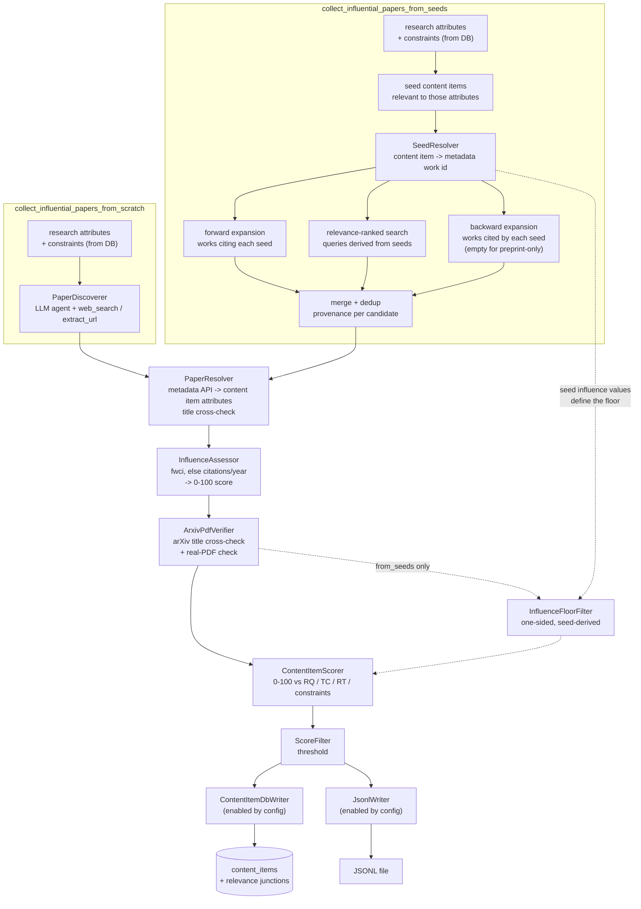

## Influential paper collection

### 1. Executive summary

#### 1.1 Spec description

The existing `collect_recent_influential_papers` script is replaced by two complementary
paper collection scripts sharing a common set of components. `collect_influential_papers_from_scratch`
takes a technical challenge, a research question or a research topic — optionally conditioned
on constraints — and discovers the most influential papers on it using web search as the
primary tool, with no prior knowledge in the database.
`collect_influential_papers_from_seeds` takes the same input but additionally uses the
already-collected relevant content items as seeds, expanding from them through the OpenAlex
citation graph and through relevance-ranked API search in order to reach a more diverse set
of influential papers than the first script can find. Both scripts resolve every discovered
paper to its canonical metadata and, where one exists and can be verified, an arXiv PDF
download url; both score papers against the research attributes held in the database and write
the results to the content database, to a JSONL file, or to both.

#### 1.2 Spec motivation

Retrospective paper collection (constitution FR2) is currently unusable: its only collector
targets the Semantic Scholar API, which answers `403 Forbidden` to unauthenticated requests
and for which no API key is available, and the pipeline ends holding results in a local
variable without ever reaching the database. Beyond restoring the capability, a single
keyword query against one API is a poor instrument for finding influential work — it depends
on the researcher already knowing the right search terms, which is precisely what is unknown
at the start of a literature review.

#### 1.3 Implementation repos

- `mourat` (this repo) — all components, scripts, configs, schema and tests.

### 2. Requirement analysis

#### 2.1 Functional requirements

1. **Research attribute input** — both scripts accept, via Hydra config, one or more
   technical challenges, research questions or research topics, identified by their database
   ids and loaded from the database at startup. Constraints are optional input. No research
   attribute text is hardcoded in a config file.
2. **Discovery from scratch** — `collect_influential_papers_from_scratch` discovers candidate
   papers using web search and url extraction as its primary instruments, driven by an LLM
   agent that receives the research attribute description and constraints. The agent's output
   is a set of paper candidates identified by bibliographic description (title, authors where
   known, and any urls it encountered); the agent is not the authority on identifiers or
   download links.
3. **Discovery from seeds** — `collect_influential_papers_from_seeds` reads the content items
   already stored as relevant to the given research attributes and uses them as seeds for
   three candidate generators:
   (a) **forward citation-graph expansion** — works that cite each seed;
   (b) **relevance-ranked API search** — over queries derived from the seeds;
   (c) **backward citation-graph expansion** — influential works cited by each seed, which
   surfaces the foundational literature the seeds build upon rather than the derivative work
   found by (a).
   Candidates from all generators are merged and de-duplicated. Generator (c) is opportunistic:
   the metadata API reports no reference list for records that exist only as preprints, so it
   is expected to yield nothing for such seeds, and an empty result from it is not an error.
   The script must remain usable when the seed set is small, and must report clearly when it is
   empty.
4. **Relevance-ranked search, never citation-ranked** — API search retrieves candidates in
   relevance order and pages through them up to a configurable budget. Sorting search results
   by citation count is prohibited: it returns highly-cited works unrelated to the query.
   Automatically-assigned topic classifications may inform query terms but must not be used
   as hard search filters.
5. **Normalised influence assessment** — influence is assessed on a field- and age-normalised
   basis, not on raw citation counts. The primary measure is the field-weighted citation
   impact reported by the metadata API, falling back to citations per year when it is
   unavailable. Every resolved paper is assessed in both scripts, and the assessment is mapped
   onto the 0-100 range the content item schema requires to become the stored influence score.
6. **Influence floor (`from_seeds` only)** — the *influence floor* is the minimum normalised
   influence a candidate must reach to be retained, expressed in the same measure as the
   assessment of FR5. In `collect_influential_papers_from_seeds` it is derived from the
   normalised influence of the seed set by a configurable rule, so that the papers already
   judged relevant and influential define the bar empirically; candidates below it are dropped
   before scoring. The floor is one-sided: a candidate far above it is a better result, never a
   rejection. `collect_influential_papers_from_scratch` applies no floor — its candidates are
   already selected for influence by the discovery agent and are few enough that the scorer can
   judge them all, and any constant threshold would be arbitrary across research topics whose
   citation norms differ.
7. **Canonical metadata resolution** — every candidate is resolved through metadata APIs, not
   through the LLM, into the attributes a content item carries: name (title), description
   (abstract), authors, publication date, url and influence score. The identifiers needed to
   perform resolution and to locate a download url — doi, arXiv id, metadata API work id — are
   used during the pipeline and reported in monitoring, but only the content item attributes
   above are persisted. A candidate whose resolved title does not match its claimed title above
   a configurable similarity threshold is marked unresolved rather than being attached to the
   wrong record.
8. **Verified arXiv download url** — a paper receives a download url only when an arXiv PDF
   url is found for it AND the arXiv id's own title, as reported by the arXiv API, matches the
   resolved paper title above a configurable similarity threshold AND the url serves a real
   PDF. Non-arXiv download urls are not recorded. When any of these conditions fails, the
   content item's url is left empty; this is intended behaviour, not an error.
9. **Relevance scoring** — resolved papers are scored 0-100 against each input research
   question, technical challenge, research topic and constraint by an LLM, with a
   justification per score, and filtered by a configurable threshold. Unlike post collection,
   constraint scores do contribute to the score used for filtering: constraints are supplied
   to these scripts deliberately and per input, so a paper that satisfies none of them is not
   a wanted result.
10. **Persistence and file output** — the run's output destinations are selected by config:
    database persistence and JSONL file output are enabled independently, so either, both or
    neither may run. Database persistence stores papers passing the threshold as content items
    with their influence score, url and per-attribute relevance scores and justifications, and
    re-running a script must update the relevance links of an already-stored paper rather than
    skipping it. JSONL output writes one paper per line, replicating the content item attributes
    together with their relevance scores and justifications, so that a run can be inspected or
    imported later without a database. Each destination is a pipeline stage, so a write failure
    is logged, timed and reported like any other stage rather than passing silently.

#### 2.2 Non-functional requirements

1. **No credentialed API dependency**: both scripts must work with freely accessible,
   unauthenticated APIs. No component on the default path may require an API key beyond the
   LLM credentials already configured.
2. **Bounded external cost**: every candidate-generating loop (search paging, per-seed
   expansion, agent tool use) is bounded by a configurable budget, so an under-specified input
   cannot cause unbounded querying.
3. **Config-driven**: all thresholds, budgets, similarity cut-offs, floors and API endpoints
   come from Hydra config. No hardcoded values in code.
4. **Metadata API politeness**: requests to metadata APIs identify the client and respect
   documented rate limits.
5. **Idempotent**: running either script twice over the same input does not create duplicate
   content items.
6. **Provenance visible in monitoring and logs**: monitoring output records, per candidate,
   which generator produced it, its normalised influence, and the reason any candidate was
   dropped or left without a download url. Logging follows the pattern established by post
   collection: stdlib `logging` with a per-module logger, no configuration in library code,
   step timings emitted by `Function.__call__`, per-item DEBUG timings inside the expensive
   loops with the external-request time separated from the LLM time, ERROR for a dropped
   candidate and WARNING for a fail-open case.

### 3. Acceptance criteria

Unit tests mock all external I/O: metadata and arXiv API responses via a mocked HTTP client
(as in `tests/test_collectors.py`), LLM behaviour via `FunctionModel` when a test must script
per-item responses and `TestModel` otherwise (as in `tests/test_enrichers.py`). No test
performs a real network request.

- **FR1 (research attribute input):** test that a script resolves configured research
  attribute ids against a temporary database and passes the loaded names and descriptions to
  the scorer; test that an id absent from the database is reported rather than silently
  ignored.
- **FR2 (discovery from scratch):** test that the discovery agent is offered the web search
  and url extraction tools and that its scripted output is parsed into paper candidates; test
  that identifiers appearing in the agent's output are not carried into the resolved paper
  unverified.
- **FR3 (discovery from seeds):** tests per generator against mocked API responses — forward
  expansion returns the citing works of each seed; relevance-ranked search returns the paged
  results; backward expansion returns the cited works of a seed that has a reference list and
  an empty result, without error, for a seed that has none. A merge test asserts that a work
  returned by more than one generator appears once in the merged output, and that its recorded
  provenance names every generator that produced it. A test asserts the script completes and
  reports the condition when the seed set is empty.
- **FR4 (relevance-ranked search):** test that the search request carries no citation-count
  sort parameter and no topic filter; test that paging stops at the configured budget when the
  mocked API offers further pages.
- **FR5 (normalised influence assessment):** test that the field-weighted impact is preferred
  when present and citations per year is used when it is absent; test that the stored influence
  score falls within 0-100 for inputs spanning several orders of magnitude; test that assessment
  runs in both scripts.
- **FR6 (influence floor):** test that the floor derived from a seed set admits a candidate
  above it and rejects one below it; test that a candidate far above the floor is retained; test
  that the derivation rule is taken from config; test that the `from_scratch` pipeline contains
  no floor filter at all.
- **FR7 (canonical metadata resolution):** test that a mocked API record is mapped onto the
  content item attributes; test that a candidate whose resolved title differs from its claimed
  title beyond the similarity threshold is marked unresolved and carries no metadata from the
  mismatched record.
- **FR8 (verified arXiv download url):** four tests over the conjunction — url recorded when
  an arXiv PDF is found, its arXiv title matches and the response is a PDF; url left empty
  when the arXiv title names a different paper (the recorded regression: an OpenAlex record
  whose sole arXiv location points at an unrelated arXiv id); url left empty when the response
  is HTML rather than a PDF; url left empty when the only available PDF is not hosted on arXiv.
- **FR9 (relevance scoring):** test that a paper is scored against every supplied research
  question, technical challenge, research topic and constraint; test that scores for ids not
  supplied to the scorer are discarded; test that a constraint score does contribute to the
  filtering score, distinguishing this behaviour from post collection.
- **FR10 (persistence and file output):** integration test against a temporary database
  verifying that passing papers are stored as content items with their attributes and
  per-attribute relevance links; test that a second run over the same paper updates its
  relevance links instead of leaving them stale; test that a JSONL file is written whose every
  line parses and carries the content item attributes with relevance scores and justifications;
  test that each destination can be enabled independently, including both at once and neither;
  test that a failing write is surfaced as a stage failure rather than silently swallowed.
- **NFR1 (no credentialed API dependency):** manual verification that both scripts run to
  completion with no API credentials configured beyond the LLM.
- **NFR2 (bounded external cost):** covered by the FR4 paging-budget test, plus a test that
  per-seed expansion stops at its configured candidate budget and a test that the discovery
  agent's tool use is bounded by its usage limits.
- **NFR3 (config-driven):** manual verification that thresholds, budgets, similarity cut-offs,
  floors and endpoints are all reachable from Hydra config, together with a test composing
  each script's config and asserting the components instantiate.
- **NFR4 (metadata API politeness):** test that outgoing requests carry the configured
  identifying header.
- **NFR5 (idempotent):** covered by the FR10 second-run test, asserting no duplicate content
  item is created.
- **NFR6 (provenance in monitoring and logs):** test that monitoring text for the candidate
  stage names the generator and normalised influence per candidate and states the reason for
  every dropped candidate and every empty url; manual verification of the log file for step
  timings and separated external-request and LLM timings.

### 4. Insight

#### 4.1 Metadata and citation-graph source

**Idea A: OpenAlex as the single metadata backbone.** One unauthenticated API supplies
relevance-ranked search, forward and backward citation edges, normalised influence measures and
candidate PDF locations.

Pros: satisfies NFR1 with no credentials; the only freely accessible option offering a citation
graph at all; carries field- and age-normalised influence measures directly, which FR5 needs;
one client, one rate-limit policy, one failure mode.
Cons: record quality is uneven — conflated records exist that merge two distinct papers, and
reference lists are absent for preprint-only records; its own PDF links are frequently dead,
paywalled or landing pages rather than PDFs.

**Idea B: Crossref for metadata plus arXiv for full text.** Crossref supplies canonical
bibliographic records by DOI or title; arXiv supplies preprints and PDFs.

Pros: Crossref records are publisher-deposited and cleaner than OpenAlex's; both APIs are
unauthenticated, so NFR1 holds.
Cons: Crossref exposes no citation graph and no citation counts, so FR3's expansion generators
and the influence assessment of FR5 and FR6 have no data source at all. Fails the requirements
despite better per-record quality.

**Idea C: Semantic Scholar with a requested API key.** The API originally targeted by the code
being replaced, offering search, citation graph and an `openAccessPdf` field.

Pros: purpose-built for this task; citation graph and influence signals in one API; would need
the least conceptual change from the existing collector.
Cons: returns `403 Forbidden` to every unauthenticated request, so it violates NFR1 unless a
key is obtained and thereafter kept valid; makes the whole feature hostage to one credential.

**Choice: Idea A, with arXiv as a second, narrowly-scoped API.** Idea B cannot supply the
citation graph or influence data that FR3, FR5 and FR6 require, and Idea C reintroduces exactly the
credential dependency that made the existing script inoperable. OpenAlex's weaknesses are real
but they are *detectable*: conflated records are caught by the title cross-check of FR7 and FR8,
missing reference lists are handled as an expected empty result in FR3, and bad PDF links are
caught by the verification of FR8. Its strengths — a citation graph and normalised influence
without credentials — are not available anywhere else. arXiv is used for exactly two purposes:
confirming that an arXiv id names the paper we think it does, and serving the PDF.

#### 4.2 Script composition

**Idea A: two scripts over a shared component library.** Two thin entry points differing only in
their candidate-generation stage; resolution, influence assessment, scoring, filtering and output
are the same components instantiated from each script's config.

Pros: each script's config states plainly what it does; the from-scratch script stays runnable
against an empty database, which is its whole purpose; matches the existing repo pattern of one
script per collection task.
Cons: two configs to maintain with a large common section.

**Idea B: one script with a `mode` switch.** A single entry point selecting between web discovery
and seed expansion.

Pros: one config, one entry point, no duplicated defaults list.
Cons: the two modes have disjoint inputs — one requires a populated database and the other
requires none — so validation becomes conditional on the mode, and a mode-specific config error
is only discoverable at runtime. A single entry point also obscures the intended workflow, in
which the two scripts run at different stages of a literature review.

**Choice: Idea A.** The shared stages are shared as *components*, not as a runtime branch, which
is what the modular architecture is for. Config duplication is handled by Hydra's defaults list
rather than by conflating two pipelines.

#### 4.3 Candidate identity and the LLM's authority boundary

**Idea A: the agent returns bibliographic descriptions only; a deterministic resolver assigns
identity.** The discovery agent emits title, authors and any urls it saw; identifiers, links and
metadata come from the metadata APIs.

Pros: an agent cannot poison the database with a plausible-looking but wrong DOI or arXiv id;
identity assignment is testable without an LLM; the same resolver serves both scripts.
Cons: a resolution step per candidate, and papers the metadata API does not index are lost even
when the agent found them correctly.

**Idea B: the agent returns identifiers directly, validated by existence checks.** The agent is
asked for DOIs and arXiv ids; the pipeline verifies each identifier resolves to a real record.

Pros: fewer requests; no title-matching problem.
Cons: an existence check confirms the identifier exists, not that it belongs to the intended
paper — a hallucinated-but-real arXiv id passes and attaches the wrong paper. This is the same
failure mode observed in a conflated metadata record, arrived at from the other direction.

**Choice: Idea A.** The failure Idea B admits is silent and corrupts stored data, which is the
worst class of failure this pipeline can have. FR2 states the boundary explicitly for this
reason.

#### 4.4 Normalised influence measure

**Idea A: field-weighted citation impact, falling back to citations per year.** Use the metadata
API's own field- and age-normalised measure; compute citations per year when it is absent.

Pros: normalises both axes that make raw counts incomparable — field and age — using the
provider's own field baselines, which cannot be reconstructed locally; costs one extra response
field.
Cons: two measures on different scales, so the floor must be derived within whichever measure a
given candidate carries; the field is absent on a minority of records, including some malformed
ones.

**Idea B: citations per year only.** Divide the citation count by the years since publication.

Pros: one measure, always computable, trivially explainable.
Cons: does not normalise by field, so a cross-field candidate admitted by loose relevance
matching still outranks on-topic work; observed in practice with epidemiology and climate papers
scoring far above on-topic machine learning papers.

**Idea C: percentile rank within the retrieved batch.** Rank candidates against each other and
keep a top fraction.

Pros: no dependence on any provider measure; always computable.
Cons: scores are relative to one run's candidate pool, so they are meaningless once stored on a
content item and incomparable between runs; a batch of uniformly weak candidates still yields
apparent top performers.

**Choice: Idea A.** Idea C produces a stored influence score that cannot be compared across runs,
which makes the persisted attribute useless. Idea B leaves the cross-field failure unaddressed,
and that failure is not hypothetical — it is what the relevance-ranked search actually returns.
The cost of Idea A is a fallback path, which FR5 makes explicit and which the acceptance criteria
test in both directions. Note that the floor of FR6 is derived within whichever measure a given
candidate carries, so a seed set and a candidate assessed by different measures are never
compared directly.

#### 4.5 Placement of PDF verification

**Idea A: verify during resolution, before scoring.** Each candidate's arXiv url is checked as
part of resolving it.

Pros: the paper reaching the scorer is already complete, so scoring and output need no notion of
a provisional url; a failed check simply leaves the url empty per FR8.
Cons: spends verification requests on candidates the scorer will later discard.

**Idea B: verify after filtering, only for papers that passed.** Resolve without checking, then
verify the survivors.

Pros: verification requests are spent only on wanted papers.
Cons: a paper's url can change after it was scored and reported, so monitoring output and stored
records disagree about the same run; two-phase state complicates the output stage for a saving
of a few HEAD requests.

**Choice: Idea A.** A ranged HEAD request is by far the cheapest operation in this pipeline —
orders of magnitude below an LLM call — so optimising its count is the wrong trade against a
paper record that is complete and final before it is scored.

#### 4.6 Relevance scorer

**Idea A: generalise the existing post scorer over an item-agnostic input.** The component that
already scores 0-100 against research questions, technical challenges, topics and constraints,
with id validation and per-score justifications, is generalised to accept a title, a body text
and optional context points, so papers and posts share it.

Pros: one scoring implementation, one prompt to tune, one 0-100 scale across content types;
future scoring changes land once; abstracts map naturally onto the body text it already expects.
Cons: touching a component the post pipeline depends on, so its tests must keep passing
unchanged.

**Idea B: a separate paper relevance scorer.** A new component mirroring the post scorer's shape
for papers.

Pros: no risk to the working post pipeline.
Cons: permanently duplicates the prompt, the id validation and the score aggregation; the
existing divergence in which paper and post scoring disagree on scale would be entrenched rather
than closed.

**Choice: Idea A.** The two scorers differ only in how the item is rendered into the prompt; the
scale, the entity handling and the output shape are identical. Duplicating that to avoid touching
a tested component trades a one-off risk, covered by existing tests, for a permanent maintenance
cost. Note that FR9's treatment of constraint scores differs from post collection, so the
constraint contribution must be a constructor parameter rather than a hardcoded rule.

#### 4.7 Seed identity resolution

Because FR7 persists only content item attributes, a stored paper carries no metadata API
identifier, yet FR3's expansion generators need one per seed.

**Idea A: re-resolve each seed at the start of the run.** Look each seed up by title, and by its
arXiv id when its url carries one, applying the same title cross-check as FR7.

Pros: no schema change; a stored seed has a clean canonical title and often an arXiv url, so it
resolves far more reliably than an LLM-emitted candidate; reuses the resolver already required.
Cons: one lookup per seed on every run, and a seed that resolves wrongly expands from the wrong
neighbourhood.

**Idea B: persist the metadata API identifier on the content item.** Add a column for it and read
it back.

Pros: exact, no re-resolution, no ambiguity.
Cons: requires a schema change the approved requirements do not call for, and binds stored
content items to one metadata provider's identifier space.

**Choice: Idea A**, with the mis-resolution risk accepted and made visible: a seed that fails the
title cross-check is reported and skipped rather than expanded from. If seed re-resolution later
proves unreliable in practice, Idea B remains available as an additive change.

### 5. Overall solution design

#### 5.1 High-level design

Both scripts share every stage except candidate generation and the influence floor. The shared
tail is drawn once; the floor filter, dashed below, belongs to `from_seeds` alone.

Ordering follows the project's cheap-before-expensive principle: every deterministic stage that
can discard a candidate — resolution and, in `from_seeds`, the influence floor — runs before the
LLM scorer, which is the most expensive stage per item. `ArxivPdfVerifier` is the one stage placed
earlier than strict cost-ordering would require: it discards nothing, but running it before
scoring keeps each paper record complete and final from that point on, per decision 4.5.

#### 5.2 Core components

Every component is a `Function[InputT, OutputT]` subclass instantiated via
`hydra.utils.instantiate(cfg.x)(monitoring_handler, ...)` with `_partial_: true`, so step
timings and monitoring come from `Function.__call__` for free.

- **`mourat.collectors.paper_discoverer.PaperDiscoverer`** — `Function[Any, PaperCandidateCollection]`.
  A pydantic-ai `Agent` given the research attribute descriptions and constraints, equipped with
  the shared `web_search` and `extract_url` tools, bounded by `UsageLimits`. Emits bibliographic
  candidates only; per 4.3 it is not trusted for identifiers.
- **`mourat.tools.web`** — the `web_search` (DuckDuckGo lite) and `extract_url` (trafilatura)
  tool factories, extracted from `enrichers.web_enricher` so the enricher and the discoverer
  share one implementation, together with the tool-call budget guard. Extraction must preserve
  the `nonlocal` accumulator behaviour the current closures rely on.
- **`mourat.clients.openalex.OpenAlexClient`** — a plain (non-`Function`) client owning the
  request policy: identifying User-Agent, `select=` field lists, cursor paging, retry and
  rate-limit handling. Exposes search, single-work lookup, forward-citation and reference
  queries. Not a `Function` because it is called from within components rather than being a
  pipeline stage.
- **`mourat.clients.arxiv.ArxivClient`** — title lookup by arXiv id (for the FR8 cross-check)
  and the ranged PDF probe.
- **`mourat.collectors.seed_expander.SeedExpander`** — `Function[SeedCollection, PaperCandidateCollection]`.
  Runs the three generators of FR3 against `OpenAlexClient`, applies per-generator budgets,
  merges and de-duplicates by work id, and records on each candidate which generators produced
  it. Also computes the seed influence distribution from which the floor is derived.
- **`mourat.resolvers.seed_resolver.SeedResolver`** — `Function[ContentItemCollection, SeedCollection]`.
  Resolves each stored content item to a metadata work id by arXiv id when its url carries one,
  else by title, applying the title cross-check; reports and skips seeds that fail it (4.7).
- **`mourat.resolvers.paper_resolver.PaperResolver`** — `Function[PaperCandidateCollection, ResolvedPaperCollection]`.
  Resolves each candidate to the content item attributes of FR7, marking as unresolved any
  candidate failing the title similarity threshold. Carries doi, arXiv id and work id in the
  in-flight model for downstream stages and monitoring, but these are not persisted.
- **`mourat.processors.influence_assessor.InfluenceAssessor`** — `Function[ResolvedPaperCollection, ResolvedPaperCollection]`.
  Computes the normalised influence measure per FR5, records which measure was used, and maps it
  onto the 0-100 `influence_score` range.
- **`mourat.processors.arxiv_pdf_verifier.ArxivPdfVerifier`** — `Function[ResolvedPaperCollection, ResolvedPaperCollection]`.
  Applies the FR8 conjunction and sets the url, or leaves it empty with a recorded reason.
- **`mourat.filters.InfluenceFloorFilter`** — `Function[ResolvedPaperCollection, ResolvedPaperCollection]`.
  The one-sided, seed-derived floor of FR6. Used only by the `from_seeds` pipeline; the
  `from_scratch` pipeline omits this stage entirely. Monitoring leads with dropped candidates and
  their influence values, per the project's filter convention.
- **`mourat.processors.content_item_scorer.ContentItemScorer`** — the generalised scorer of 4.6,
  `Function[ResolvedPaperCollection, ScoredPaperCollection]` on the paper path and correspondingly
  on the post path, rendering any item from a title, a body text and optional context points. This
  is `PostScorer` renamed and generalised, not a new component beside it, so no post-specific
  scorer remains. Gains a constructor parameter deciding whether constraint scores contribute to
  the filtering score: false for post collection, true here per FR9.
- **`mourat.filters.ScoreFilter`** — `Function[ScoredPaperCollection, ScoredPaperCollection]`.
  Drops papers whose `filtering_score` is below the configured threshold (FR9). This is
  `PostScoreFilter` generalised over the item type alongside the scorer, for the same reason.
- **`mourat.writers.db_writer.ContentItemDbWriter`** — `Function[ScoredPaperCollection, ScoredPaperCollection]`.
  Writes passing papers to `content_items` and their relevance junctions, upserting so that a
  re-run refreshes the relevance links of an already-stored paper (FR10). Returns its input
  unchanged so it composes like any other stage; monitoring reports created, updated and failed
  counts with the reason per failure.
- **`mourat.writers.jsonl_writer.JsonlWriter`** — `Function[ScoredPaperCollection, ScoredPaperCollection]`.
  Writes one line per paper carrying the content item attributes plus relevance scores and
  justifications (FR10), and likewise passes its input through.

  Both are `Function`s rather than plain module functions, unlike the save path of
  `collect_posts.py`: that pattern keeps the most failure-prone step of the pipeline outside the
  step timings, the monitoring channel and the `try/except: logger.exception` funnel of
  `Function.__call__` — which is how a run can currently persist nothing while appearing to
  succeed. Passing their input through keeps the two destinations independent and composable.
- **`mourat.scripts.collect_influential_papers_from_scratch`** and
  **`mourat.scripts.collect_influential_papers_from_seeds`** — the two entry points, each
  composing its own candidate-generation stage with the shared tail and the writer stage or
  stages selected by config.

#### 5.3 Data models

New Pydantic models in `data_models.py`, each collection model wrapping a list per the
architectural invariant:

- **`PaperCandidate`** — what discovery produces: `title`, `authors`, `urls_seen`,
  `provenance` (which generator or the agent), optional `work_id` when a generator supplied one.
  **`PaperCandidateCollection`** wraps them.
- **`Seed`** — a resolved seed: `content_item_id`, `work_id`, `title`, `influence_value`.
  **`SeedCollection`** wraps them.
- **`ResolvedPaper`** — the content item attributes (`title`, `abstract`, `authors`,
  `publication_date`, `url`, `influence_score`) plus in-flight-only `doi`, `arxiv_id`, `work_id`,
  `influence_measure_used`, `resolution_status` and `url_absent_reason`.
  **`ResolvedPaperCollection`** wraps them.
- **`ScoredPaper`** — a `ResolvedPaper` plus `relevance_scores: list[ScoreEntry]` and
  `filtering_score`. **`ScoredPaperCollection`** wraps them. `ScoreEntry` is reused unchanged.
- **`ContentItemCollection`** — wraps the existing `ContentItem` model, which currently has no
  collection wrapper, so that `SeedResolver` can take a proper Pydantic collection as its input
  type per the architectural invariant.

The existing `PaperInfo` / `ScoredPaperInfo` / `AssignedPaperInfo` models are left untouched, as
the scripts using them are outside this spec's scope.

One rename outside the new models: `ScoredRedditPost.max_score` becomes `filtering_score`, the
name used by `ScoredPaper`. The field stopped being a maximum over a subset once FR9 let
constraint scores contribute, and one concept must carry one name across both content types.

#### 5.4 Configuration

Two main configs, `config/config_collect_influential_papers_from_scratch.yaml` and
`config/config_collect_influential_papers_from_seeds.yaml`, each a `defaults:` list composing
`monitoring_handler`, LLM aliases (a discovery LLM and a scoring LLM, separately swappable), and
one config group file per component. Component group files start directly with `_target_` and
carry no `defaults:` block. Research attribute ids, budgets, thresholds, similarity cut-offs, the
floor, the writer enable flags and the JSONL output path are all config values; `db_path` comes from
`user_settings` as in the existing scripts.

### 6. Implementation plan

#### 6.1 Todo list

Phases are ordered by real dependency: the data models and API clients settle before the
components that consume them, both scripts' shared tail exists before either entry point, and
`from_scratch` lands before `from_seeds` because the latter needs a populated database to seed
from — which the former is the only way to produce.

**Phase 1 — foundations**

1. **Add the data models** — `PaperCandidate(Collection)`, `Seed(Collection)`,
   `ResolvedPaper(Collection)`, `ScoredPaper(Collection)` and `ContentItemCollection` in
   `data_models.py`, per 5.3.
2. **Rename `max_score` to `filtering_score`** in `ScoredRedditPost`, `PostScorer`,
   `PostScoreFilter` and their tests. Independent of everything else and best done before the
   scorer is generalised, so the rename and the generalisation are not entangled in one diff.
3. **Extract the web tools** — move the `web_search` and `extract_url` tool factories and the
   tool-call budget guard from `enrichers/web_enricher.py` into `mourat/tools/web.py`,
   preserving the `nonlocal` accumulator behaviour, and have `WebEnricher` import them. The
   existing enricher tests must pass unchanged.
4. **Write `OpenAlexClient`** — identifying User-Agent, `select=` field lists, cursor paging,
   retry with backoff, and the four query shapes: relevance search, single-work lookup,
   forward-citation query, reference lookup. Tests use a mocked HTTP client.
5. **Write `ArxivClient`** — title lookup by arXiv id and the ranged PDF probe checking status,
   content type and the `%PDF-` magic bytes.

**Phase 2 — shared tail**

6. **Write `PaperResolver` and the shared similarity utility** — candidate to content item
   attributes via `OpenAlexClient`, with the title similarity check and the unresolved outcome
   (FR7). The normalised-title comparison goes in `mourat/utils/similarity.py`, since
   `SeedResolver` and `ArxivPdfVerifier` both need it.
7. **Write `InfluenceAssessor`** — `fwci` preferred, citations per year as fallback, the measure
   used recorded, and the 0-100 mapping for `influence_score` (FR5).
8. **Write `ArxivPdfVerifier`** — the FR8 conjunction, setting the url or recording why it stayed
   empty.
9. **Rename `PostScorer` to `ContentItemScorer` and generalise its input** — the prompt builder
   takes a title, body text and optional context points instead of a `RedditPostInfo`; the
   constraint contribution becomes a constructor parameter. Generalise `PostScoreFilter` to
   `ScoreFilter` in the same pass, since it reads the renamed field. `collect_posts.py` maps its
   enriched posts onto the neutral shape and calls both, so no post-specific scorer or filter
   survives. The existing post scorer and filter tests must pass with the renames applied and no
   change in behaviour.
10. **Write the two writers** — `ContentItemDbWriter` (upserting, so a re-run refreshes relevance
    links) and `JsonlWriter`, both pass-through `Function`s (FR10).

**Phase 3 — the from-scratch script**

11. **Write `PaperDiscoverer`** — the discovery agent over the shared web tools, bounded by
    `UsageLimits`, emitting bibliographic candidates only (FR2).
12. **Write `collect_influential_papers_from_scratch`** — load research attributes and
    constraints from the database, compose discoverer → resolver → assessor → verifier → scorer →
    `ScoreFilter` → writers.
13. **Write its configs** — the main config plus one group file per component.
14. **Test the from-scratch pipeline** — the FR1, FR2, FR5, FR7, FR8, FR9 and FR10 criteria of
    section 3, plus the config-composition test of NFR3.

**Phase 4 — the from-seeds script**

15. **Write `SeedResolver`** — content item to work id by arXiv id or title, with the cross-check
    and the report-and-skip outcome (4.7).
16. **Write `SeedExpander`** — the three generators, per-generator budgets, merge and dedup by
    work id, provenance per candidate, and the seed influence distribution (FR3, FR4).
17. **Write `InfluenceFloorFilter`** — the one-sided seed-derived floor with its configurable
    derivation rule, monitoring leading with dropped candidates (FR6).
18. **Write `collect_influential_papers_from_seeds`** — load research attributes, read seed
    content items from the database, compose seed resolver → expander → resolver → assessor →
    verifier → floor filter → scorer → `ScoreFilter` → writers.
19. **Write its configs** — as for the from-scratch script, plus the generator budgets and the
    floor derivation rule.
20. **Test the from-seeds pipeline** — the FR3, FR4 and FR6 criteria, the empty-seed-set case, and
    its own config-composition test.

**Phase 5 — verification**

21. **Run the full suite and the linters** — `pytest`, then `black --check`, `isort --check`,
    `pylint` (errors only) and `mypy` scoped per file, invoked as `python -m ...` from the project
    venv. `web_enricher.py` carries three pre-existing mypy errors; confirm against `main` before
    treating any mypy finding as a regression.
22. **Manual verification** — the NFR1 credential-free run, the NFR3 config reachability check and
    the NFR6 log inspection for step timings and separated request and LLM timings.

#### 6.2 Modification summary

| File | Action |
|------|--------|
| `mourat/data_models.py` | Modified: new candidate/seed/resolved/scored models, `ContentItemCollection`, `max_score` renamed |
| `mourat/tools/__init__.py` | New: package marker |
| `mourat/tools/web.py` | New: shared `web_search` and `extract_url` tool factories and budget guard |
| `mourat/enrichers/web_enricher.py` | Modified: import the shared tools instead of defining them |
| `mourat/clients/__init__.py` | New: package marker |
| `mourat/clients/openalex.py` | New: OpenAlex API client |
| `mourat/clients/arxiv.py` | New: arXiv title lookup and PDF probe |
| `mourat/utils/similarity.py` | New: normalised title similarity shared by the resolvers and the verifier |
| `mourat/collectors/paper_discoverer.py` | New: `PaperDiscoverer` |
| `mourat/collectors/seed_expander.py` | New: `SeedExpander` |
| `mourat/resolvers/__init__.py` | New: package marker |
| `mourat/resolvers/paper_resolver.py` | New: `PaperResolver` |
| `mourat/resolvers/seed_resolver.py` | New: `SeedResolver` |
| `mourat/processors/__init__.py` | New: package marker (the package currently has none) |
| `mourat/enrichers/__init__.py` | New: package marker (the package currently has none) |
| `mourat/processors/influence_assessor.py` | New: `InfluenceAssessor` |
| `mourat/processors/arxiv_pdf_verifier.py` | New: `ArxivPdfVerifier` |
| `mourat/processors/content_item_scorer.py` | New: `PostScorer` renamed here and generalised over the item shape |
| `mourat/processors/post_scorer.py` | Removed: renamed to `content_item_scorer.py` |
| `mourat/filters.py` | Modified: add `InfluenceFloorFilter`; `PostScoreFilter` generalised to `ScoreFilter` |
| `mourat/writers/__init__.py` | New: package marker |
| `mourat/writers/db_writer.py` | New: `ContentItemDbWriter` |
| `mourat/writers/jsonl_writer.py` | New: `JsonlWriter` |
| `mourat/scripts/collect_influential_papers_from_scratch.py` | New: from-scratch entry point |
| `mourat/scripts/collect_influential_papers_from_seeds.py` | New: from-seeds entry point |
| `config/config_collect_influential_papers_from_scratch.yaml` | New: main config |
| `config/config_collect_influential_papers_from_seeds.yaml` | New: main config |
| `config/paper_discoverer/default.yaml` | New: component config |
| `config/seed_expander/default.yaml` | New: component config |
| `config/paper_resolver/default.yaml` | New: component config |
| `config/seed_resolver/default.yaml` | New: component config |
| `config/influence_assessor/default.yaml` | New: component config |
| `config/arxiv_pdf_verifier/default.yaml` | New: component config |
| `config/influence_floor_filter/default.yaml` | New: component config |
| `config/score_filter/default.yaml` | New: component config |
| `config/content_item_scorer/default.yaml` | New: component config |
| `config/db_writer/default.yaml` | New: component config |
| `config/jsonl_writer/default.yaml` | New: component config |
| `config/config_collect_posts.yaml` | Modified: inline `scorer._target_` points at `ContentItemScorer`, constraint contribution set false |
| `mourat/scripts/collect_posts.py` | Modified: map enriched posts onto the neutral item shape; follow the rename |
| `tests/test_clients.py` | New: OpenAlex and arXiv client tests |
| `tests/test_resolvers.py` | New: paper and seed resolver tests |
| `tests/test_collectors.py` | Modified: add discoverer and seed expander tests |
| `tests/test_processors.py` | Modified: add assessor, verifier and generalised scorer tests |
| `tests/test_filters.py` | Modified: add influence floor filter tests |
| `tests/test_writers.py` | New: db and JSONL writer tests |
| `tests/test_enrichers.py` | Modified: follow the tool extraction |
| `tests/test_imports.py` | Modified: import tests for every new module |

#### 6.3 Out of scope

- Downloading or parsing PDF full text. The scripts record verified urls; fetching and analysing
  the documents is separate work.
- Retiring `collect_recent_influential_papers` (which uses `SemanticScholarPaperCollector`,
  `BinaryPaperClassifier`, `PaperScorer` and `ScoreBasedPaperFilter`) and `collect_newest_papers`
  (which uses `ArxivPaperCollector` and `PaperAssigner`). The user retires these separately. Note
  that `ArxivPaperCollector` must survive regardless, as `collect_newest_papers` is the only
  consumer of the arXiv feed and is not replaced here.
- The constitution spec's §6.1 M4 row, which names the script being replaced, and its §5.1
  diagram, which names a `collect_influential_papers` tool that becomes two. Revising the
  constitution needs its own approval.
- Schema changes. No new column or table is required, per FR7.
- Fixing the post pipeline's skip-on-duplicate behaviour. FR10 requires the correct behaviour of
  the new writers; the post path keeps its current behaviour until addressed on its own.
- Concurrency. Both scripts stay sequential; concurrent processing is milestone M8.
