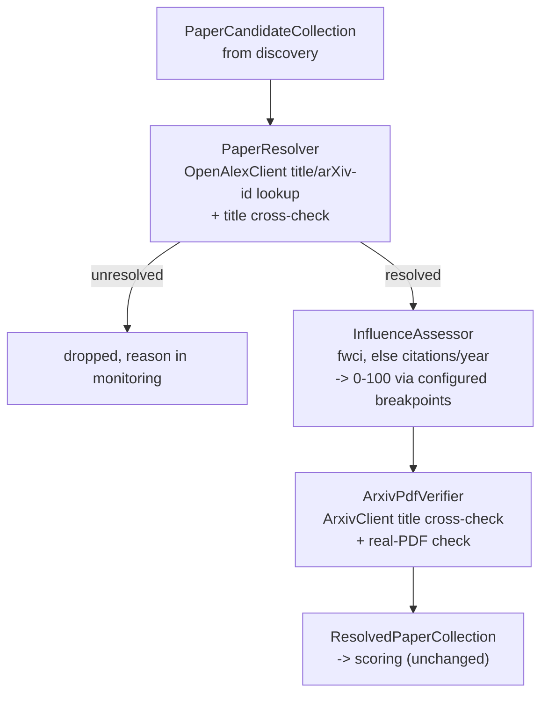

## Paper resolution

### 1. Executive summary

#### 1.1 Spec description

Papers discovered by `collect_influential_papers_from_scratch` are resolved, before scoring, from
the bibliographic descriptions an LLM agent produced into canonical records drawn from metadata
APIs: name (title), description (abstract), authors, publication date, and a field- and
age-normalised influence score on the 0-100 range. Where a paper has an arXiv PDF that can be
verified to belong to it, the paper's url becomes that PDF url; otherwise the url is left empty.
Resolution is performed by deterministic code against unauthenticated APIs, never by an LLM, and a
candidate whose resolved record does not demonstrably name the paper that was asked for is marked
unresolved and carries no metadata from the mismatched record. The agent-written description and
the as-encountered url that the collection script currently stores are replaced by these canonical
values.

#### 1.2 Spec motivation

The collection script currently stores what its discovery agent wrote: a description paraphrased
from whatever web page it read, a url that was never checked to be a document of the paper at all,
and no influence score, since nothing computes one. That makes the stored records unusable for the
purpose the pipeline exists to serve — a paper whose stated influence is unknown cannot be compared
against another, and a url that may point at a citation listing, a paywall or an unrelated paper
cannot be followed.

Resolution is also where the pipeline is most exposed to silent data corruption: metadata records
exist that merge two distinct papers, and a record's sole arXiv location can point at a different
paper's genuinely downloadable PDF, so a naive resolver stores plausible and wrong data with no
visible symptom.

#### 1.3 Implementation repos

- `mourat` (this repo) — the API clients, the resolver and the two processors, the modified script
  and configs, and tests.

### 2. Requirement analysis

#### 2.1 Functional requirements

1. **Canonical metadata resolution** — every discovered candidate is resolved through metadata APIs,
   not through an LLM, into the attributes a content item carries: name (title), description
   (abstract), authors, publication date and url. Lookup uses the candidate's claimed title, and its
   arXiv id when one of the urls the discovery agent encountered carries one. A candidate whose
   resolved title does not match its claimed title above a configurable similarity threshold is
   marked unresolved and carries no metadata from the mismatched record; a candidate no API indexes
   is likewise marked unresolved. Any identifier appearing on a candidate is a lookup hint only: no
   identifier, url or metadata value reaches the resolved record unless it came from a record whose
   title matched.
2. **Identifiers travel but are not persisted** — the identifiers needed to resolve a paper and
   locate its download url — doi, arXiv id, metadata API work id — travel with the paper through the
   pipeline and appear in monitoring, but are not part of the persisted attribute set. No schema
   change is required.
3. **Normalised influence assessment** — influence is assessed on a field- and age-normalised basis,
   never on raw citation counts. The primary measure is the field-weighted citation impact reported
   by the metadata API, falling back to citations per year when it is unavailable. Which measure was
   used is recorded on the paper and reported in monitoring. The assessment is mapped onto the 0-100
   range the content item schema requires, and the mapping must place papers assessed by either
   measure on the same stored scale, so that two stored influence scores are comparable regardless
   of which measure produced them.
4. **Verified arXiv download url** — a paper receives a download url only when an arXiv PDF url is
   found for it AND the arXiv id's own title, as reported by the arXiv API, matches the resolved
   paper title above a configurable similarity threshold AND the url serves a real PDF. Non-arXiv
   download urls are not recorded. When any condition fails, the url is left empty and the reason is
   recorded; this is intended behaviour, not an error.
5. **Unresolved candidates are not scored or stored** — a candidate marked unresolved is dropped
   before scoring, with its claimed title and the reason reported in monitoring. Spending an LLM
   call on a paper whose identity is unknown produces a score that cannot be attributed to anything.

#### 2.2 Non-functional requirements

1. **No credentialed API dependency**: every API used is freely accessible and unauthenticated. No
   component requires an API key beyond the LLM credentials already configured.
2. **Metadata API politeness**: outgoing requests identify the client with a configured User-Agent,
   request only the fields needed, and respect documented rate limits with retry and backoff.
3. **Bounded external cost**: the number of requests per candidate is bounded — resolution performs
   a bounded lookup sequence and no loop over API results is unbounded, so a candidate set cannot
   cause unbounded querying.
4. **Config-driven, with observable provenance**: all similarity thresholds, endpoints, field lists
   and retry parameters come from Hydra config; no hardcoded values in code. Monitoring records, per
   candidate, whether it resolved, the identifiers it resolved to, which influence measure was used,
   and the reason for any absent url or unresolved outcome. Logging follows the established pattern:
   stdlib `logging` per module, no configuration in library code, step timings from
   `Function.__call__`, per-item DEBUG timings with external-request time separated, ERROR for a
   candidate dropped as unresolved and WARNING for a fallback or retry.

### 3. Acceptance criteria

Unit tests mock all external I/O: metadata and arXiv API responses via a mocked HTTP client (as in
`tests/test_collectors.py`), LLM behaviour via `TestModel` where a test needs the scorer at all. No
test performs a real network request, and no test asserts against a live API's ranking or field
values.

- **FR1 (canonical metadata resolution):** test that a mocked API record is mapped onto the content
  item attributes; test that lookup by arXiv id is used when a candidate's urls carry one and title
  lookup otherwise; test that a candidate whose resolved title differs from its claimed title beyond
  the threshold is marked unresolved and carries no field from the mismatched record; test that a
  candidate no API indexes is marked unresolved rather than raising; test that a doi supplied on a
  candidate does not appear in the resolved record when the record it names fails the title check.
- **FR2 (identifiers travel but are not persisted):** test that the in-flight model carries doi,
  arXiv id and work id and that monitoring text names them; test that the attribute set written for
  a paper contains no identifier field. A test asserting the schema is unchanged is not needed — no
  task in this spec touches `schema.sql`.
- **FR3 (normalised influence assessment):** test that the field-weighted impact is preferred when
  present and citations per year is used when it is absent or malformed; test that the measure used
  is recorded; test that the stored score falls within 0-100 for inputs spanning several orders of
  magnitude, including a zero-citation paper and an extreme outlier; test that two papers with equal
  standing under different measures map to comparable stored scores, which is the criterion that
  would fail if each measure were mapped by its own independent scale.
- **FR4 (verified arXiv download url):** five tests over the conjunction — url recorded when an
  arXiv PDF is found, its arXiv title matches and the response is a PDF; url left empty when the
  arXiv title names a different paper (the recorded regression: a metadata record whose sole arXiv
  location points at an unrelated arXiv id); url left empty when the response is HTML rather than a
  PDF despite a successful status; url left empty when the only available PDF is not hosted on
  arXiv; url recorded when the PDF probe answers `206 Partial Content`, since a ranged request is
  the normal success path and rejecting anything but `200` would leave every url empty.
- **FR5 (unresolved candidates are not scored or stored):** test that an unresolved candidate does
  not reach the scorer; test that its claimed title and failure reason appear in monitoring; test
  that a run in which every candidate fails resolution completes and reports the condition rather
  than erroring.
- **NFR1 (no credentialed API dependency):** manual verification that the script runs to completion
  with no API credentials configured beyond the LLM.
- **NFR2 (metadata API politeness):** test that outgoing requests carry the configured identifying
  User-Agent and the configured field list; test that a `429` or `5xx` response is retried with
  backoff and that retries are bounded.
- **NFR3 (bounded external cost):** test that resolving one candidate issues no more than the
  configured number of requests, and that a paged API response does not cause the client to follow
  pages indefinitely — the cursor sentinel must be sent on the first request, since a client that
  omits it silently receives one page and reports no error.
- **NFR4 (config-driven, with observable provenance):** test composing the script's config and
  asserting every component instantiates; covered for monitoring content by the FR2, FR3 and FR5
  criteria. Manual verification of the log file for step timings, separated external-request
  timings, and the config reachability of thresholds, endpoints and field lists.

### 4. Insight

#### 4.1 Metadata and influence source

**Idea A: OpenAlex as the single metadata backbone, with arXiv narrowly scoped.** One
unauthenticated API supplies title search, single-work lookup, normalised influence measures and
candidate PDF locations. arXiv is used for exactly two purposes: confirming that an arXiv id names
the paper we think it does, and serving the PDF.

Pros: satisfies NFR1 with no credentials; carries a field- and age-normalised influence measure
directly, which FR3 needs and which cannot be reconstructed locally without field baselines; one
client, one rate-limit policy, one failure mode.
Cons: record quality is uneven — conflated records exist that merge two distinct papers, and its
own PDF links are frequently dead, paywalled or landing pages rather than PDFs.

**Idea B: Crossref for metadata plus arXiv for full text.** Crossref supplies publisher-deposited
bibliographic records by DOI or title; arXiv supplies preprints and PDFs.

Pros: Crossref records are publisher-deposited and cleaner per record than OpenAlex's; both APIs
are unauthenticated, so NFR1 holds.
Cons: Crossref exposes no citation counts and no normalised impact measure, so FR3 has no data
source at all. Fails a requirement despite better per-record quality.

**Idea C: Semantic Scholar.** The API the replaced collector originally targeted, offering search,
influence signals and an `openAccessPdf` field.

Pros: purpose-built for this task; influence signals and PDF location in one API.
Cons: returns `403 Forbidden` to every unauthenticated request and no key is available, so it
violates NFR1 outright.

**Choice: Idea A.** Idea B cannot supply the influence data FR3 requires and Idea C is unreachable.
OpenAlex's weaknesses are real but they are *detectable*, and every one of them has a requirement
that catches it: conflated records are caught by FR1's title cross-check, bad PDF links by FR4's
verification conjunction. Its strengths — a normalised influence measure without credentials — are
available nowhere else. Two practical consequences that shape §5: OpenAlex returns JSON but arXiv
answers Atom XML, so the two clients cannot share a response parser; and OpenAlex's paged endpoints
require an explicit cursor sentinel on the first request, without which a client silently receives
one page.

#### 4.2 Normalised influence measure

**Idea A: field-weighted citation impact, falling back to citations per year.** Use the provider's
own field- and age-normalised measure; compute citations per year when it is absent.

Pros: normalises both axes that make raw counts incomparable — field and age — using field
baselines that cannot be reconstructed locally; costs one extra response field.
Cons: two measures on different scales, so the mapping of FR3 must reconcile them; the field is
absent on a minority of records, including some malformed ones.

**Idea B: citations per year only.** Divide the citation count by the years since publication.

Pros: one measure, always computable, trivially explainable.
Cons: does not normalise by field. Measured: a machine-learning query returned a statistics
software paper with a field-weighted impact in the thousands and eighty-eight thousand citations at
rank one — under Idea B such cross-field arrivals outrank every on-topic paper, and the influence
score stops meaning "influential in its field".

**Idea C: percentile rank within the resolved batch.** Rank candidates against each other and store
the percentile.

Pros: no dependence on any provider measure; always computable; trivially bounded to 0-100.
Cons: scores are relative to one run's candidate pool, so they are meaningless once stored and
incomparable between runs. A batch of uniformly weak candidates still yields apparent top
performers.

**Choice: Idea A.** Idea C produces a stored score that cannot be compared across runs, which makes
the persisted attribute useless — and comparability is the whole reason the column exists. Idea B
leaves the cross-field failure unaddressed, and that failure is measured, not hypothetical. The
cost of Idea A is a fallback path and a reconciliation problem, which FR3 makes explicit and which
4.3 resolves.

#### 4.3 Mapping the assessment onto 0-100

FR3 requires that two stored scores be comparable regardless of which measure produced them, so the
two measures must land on one scale.

**Idea A: fixed configured breakpoints per measure.** Each measure carries a configured list of
value → score breakpoints, chosen so that the same standing in either measure maps to the same
score, with linear interpolation between them and saturation at the ends.

Pros: the mapping is stable across runs, so stored scores stay comparable over time; a paper's
score does not change because a different batch was resolved alongside it; the breakpoints are
config, so they can be retuned without touching code.
Cons: the breakpoints are a judgement call, and a badly chosen set compresses most papers into a
narrow band.

**Idea B: normalise within the resolved batch.** Map each measure's values onto 0-100 by their
position within the current batch.

Pros: no judgement calls; always uses the full range.
Cons: this is 4.2's Idea C wearing a different hat — a stored score that means something different
in every run. Rejected for the same reason.

**Idea C: a fixed analytic transform, such as a log-scaled ratio to a reference value.** Map by a
closed-form function of the measure with one configured reference point.

Pros: fewer config values than breakpoints; smooth and monotone by construction.
Cons: one reference point cannot reconcile two measures whose distributions differ in shape, so
equal standing under the two measures maps to different scores — which is precisely what FR3
forbids.

**Choice: Idea A.** It is the only option that keeps stored scores comparable both across runs and
across measures. The judgement-call cost is real but it lands in config, where it can be retuned
against observed data without a code change, and the FR3 comparability criterion is what holds the
two breakpoint sets honest.

### 5. Overall solution design

#### 5.1 High-level design

Resolution is the first stage after discovery and before the existing scorer, so a candidate that
cannot be identified is discarded at the cheapest point available — before any LLM call is spent on
it. `ArxivPdfVerifier` runs after influence assessment rather than before: assessment needs only the
resolved metadata, and ordering it first means a candidate that assessment might still reject some
other way is not made to wait on a PDF probe it may not need. (Nothing in this spec drops a
candidate after resolution succeeds, so the two processors could run in either order; assessment
first matches the order FR3 and FR4 are stated in.) Once verified, the paper carries exactly the
attributes the existing writers already expect — no writer changes.

#### 5.2 Core components

Every component is a `Function[InputT, OutputT]` subclass instantiated via
`hydra.utils.instantiate(cfg.x)(monitoring_handler, ...)` with `_partial_: true`, so step timings
and monitoring come from `Function.__call__` for free.

- **`mourat.clients.openalex.OpenAlexClient`** — a plain (non-`Function`) client owning the request
  policy: identifying User-Agent, `select=` field lists, the `cursor=*` sentinel on the first
  request of any paged call, retry with backoff. Exposes title search and single-work lookup by id.
  Not a `Function` because it is called from within components rather than being a pipeline stage.
- **`mourat.clients.arxiv.ArxivClient`** — title lookup by arXiv id, parsing the Atom XML response
  with `xml.etree.ElementTree` and collapsing whitespace-mangled titles before comparison; and the
  ranged PDF probe, accepting both `200` and `206` as a successful status. An unknown arXiv id
  returns a normal empty feed, not an error, and the client must treat that as "not found" rather
  than raising.
- **`mourat.utils.similarity.py`** — the normalised-title comparison shared by `PaperResolver` and
  `ArxivPdfVerifier`: case-folded, whitespace-collapsed, a configurable similarity threshold.
- **`mourat.resolvers.paper_resolver.PaperResolver`** — `Function[PaperCandidateCollection, ResolvedPaperCollection]`.
  Looks a candidate up by arXiv id when one of its urls carries one, else by title, via
  `OpenAlexClient`; applies the title cross-check; marks unresolved candidates and drops them,
  reporting the reason (FR1, FR5). Carries doi, arXiv id and work id in the in-flight model for the
  two processors and for monitoring, but these are not persisted (FR2).
- **`mourat.processors.influence_assessor.InfluenceAssessor`** — `Function[ResolvedPaperCollection, ResolvedPaperCollection]`.
  Computes the normalised influence measure per 4.2, records which measure was used, and maps it
  onto 0-100 via the configured breakpoints of 4.3 (FR3).
- **`mourat.processors.arxiv_pdf_verifier.ArxivPdfVerifier`** — `Function[ResolvedPaperCollection, ResolvedPaperCollection]`.
  Applies the FR4 conjunction via `ArxivClient`, setting the paper's url or leaving it empty with a
  recorded reason.
- **`collect_influential_papers_from_scratch`** (modified) — the resolver and the two processors
  are inserted between discovery and scoring; the writers are unchanged, since a resolved paper
  carries exactly the attributes they already write.

#### 5.3 Data models

- **`ResolvedPaper`** — the content item attributes (`title`, `abstract`, `authors`,
  `publication_date`, `url`) plus in-flight-only `doi`, `arxiv_id`, `work_id`, `influence_score`,
  `influence_measure_used`, `resolution_status`, `url_absent_reason`. **`ResolvedPaperCollection`**
  wraps them.
- **`PaperCandidate`** is read, not modified: the resolver consumes `title`, `authors`, `urls_seen`
  and carries `description` forward into `ResolvedPaper.abstract` only when resolution fails to
  supply one — see the note below.
- **`ScoredPaper`**, produced by the existing scorer, is redefined to wrap a `ResolvedPaper` instead
  of a `PaperCandidate`, carrying the same `relevance_scores` and `filtering_score` fields it
  already has. This is a type change to an existing model's base, not a new model.

Note on `description`/`abstract`: resolution's canonical abstract replaces the discovery agent's
description whenever resolution succeeds. Because a candidate that fails resolution is dropped
(FR5), no resolved paper ever carries the agent's description — every `ResolvedPaper.abstract`
reaching the scorer came from a metadata API.

#### 5.4 Configuration

Two new component config group files, `config/paper_resolver/default.yaml` and
`config/influence_assessor/default.yaml` and `config/arxiv_pdf_verifier/default.yaml`, each starting
directly with `_target_` and carrying no `defaults:` block, added to
`config/config_collect_influential_papers_from_scratch.yaml`'s existing `defaults:` list between the
discoverer and the scorer. The title similarity threshold, the influence measure breakpoints, the
arXiv PDF probe's retry count and timeout, and the OpenAlex `select=` field list are all config
values.

### 6. Implementation plan

#### 6.1 Todo list

Phases are ordered by real dependency: the API clients settle before anything that calls them,
`PaperResolver` lands before the two processors since both need a resolved paper to run against,
and the script wiring comes last because it depends on all three.

**Phase 1 — clients and shared utility**

1. **Write `OpenAlexClient`** — identifying User-Agent, `select=` field lists, the `cursor=*`
   sentinel on the first request of any paged call, retry with backoff, title search and
   single-work lookup. Tests use a mocked HTTP client.
2. **Write `ArxivClient`** — title lookup by arXiv id parsing Atom XML, treating an empty feed as
   not-found; the ranged PDF probe accepting `200` and `206`, checking content type and the `%PDF-`
   magic bytes.
3. **Write the similarity utility** — `mourat/utils/similarity.py`, case-folded and
   whitespace-collapsed comparison against a configurable threshold.

**Phase 2 — resolver and processors**

4. **Redefine `ScoredPaper`** to wrap `ResolvedPaper` instead of `PaperCandidate`, and add
   `ResolvedPaper(Collection)` to `data_models.py`, per 5.3.
5. **Write `PaperResolver`** — arXiv-id-then-title lookup via `OpenAlexClient`, the title
   cross-check, dropping unresolved candidates with the reason recorded (FR1, FR5).
6. **Write `InfluenceAssessor`** — `fwci` preferred, citations per year as fallback, the measure
   used recorded, and the configured-breakpoint mapping onto `influence_score` (FR3).
7. **Write `ArxivPdfVerifier`** — the FR4 conjunction via `ArxivClient`, setting the url or
   recording why it stayed empty.

**Phase 3 — wiring**

8. **Insert the three components into `collect_influential_papers_from_scratch`** between
   discovery and scoring, per 5.1's ordering.
9. **Write the three config group files** and add them to the script's `defaults:` list.

**Phase 4 — verification**

10. **Write the tests** — every criterion in section 3.
11. **Run the full suite and the linters** — `pytest`, then `black --check`, `isort --check`,
    `pylint` (errors only) and `mypy` scoped per file, invoked as `python -m ...` from the project
    venv.
12. **Manual verification** — re-run the script against the same research question used to verify
    the collection script, and diff the JSONL: abstracts and publication dates now populate,
    influence scores populate and are comparable across the two measures where both appear in the
    run, and urls either become real arXiv PDFs or empty with a recorded reason rather than an
    unchecked link. Confirm the credential-free run (NFR1) and inspect the log for step timings and
    separated external-request time (NFR4).

#### 6.2 Modification summary

| File | Action |
|------|--------|
| `mourat/clients/__init__.py` | New: package marker |
| `mourat/clients/openalex.py` | New: `OpenAlexClient` |
| `mourat/clients/arxiv.py` | New: `ArxivClient` |
| `mourat/utils/similarity.py` | New: shared title similarity |
| `mourat/resolvers/__init__.py` | New: package marker |
| `mourat/resolvers/paper_resolver.py` | New: `PaperResolver` |
| `mourat/processors/influence_assessor.py` | New: `InfluenceAssessor` |
| `mourat/processors/arxiv_pdf_verifier.py` | New: `ArxivPdfVerifier` |
| `mourat/data_models.py` | Modified: add `ResolvedPaper(Collection)`; `ScoredPaper` redefined to wrap it |
| `mourat/scripts/collect_influential_papers_from_scratch.py` | Modified: insert resolver and processors between discovery and scoring |
| `config/config_collect_influential_papers_from_scratch.yaml` | Modified: three new entries in `defaults:` |
| `config/paper_resolver/default.yaml` | New: component config |
| `config/influence_assessor/default.yaml` | New: component config |
| `config/arxiv_pdf_verifier/default.yaml` | New: component config |
| `tests/test_clients.py` | New: `OpenAlexClient` and `ArxivClient` tests |
| `tests/test_resolvers.py` | New: `PaperResolver` tests |
| `tests/test_processors.py` | Modified: add assessor and verifier tests |
| `tests/test_imports.py` | Modified: import tests for every new module |
