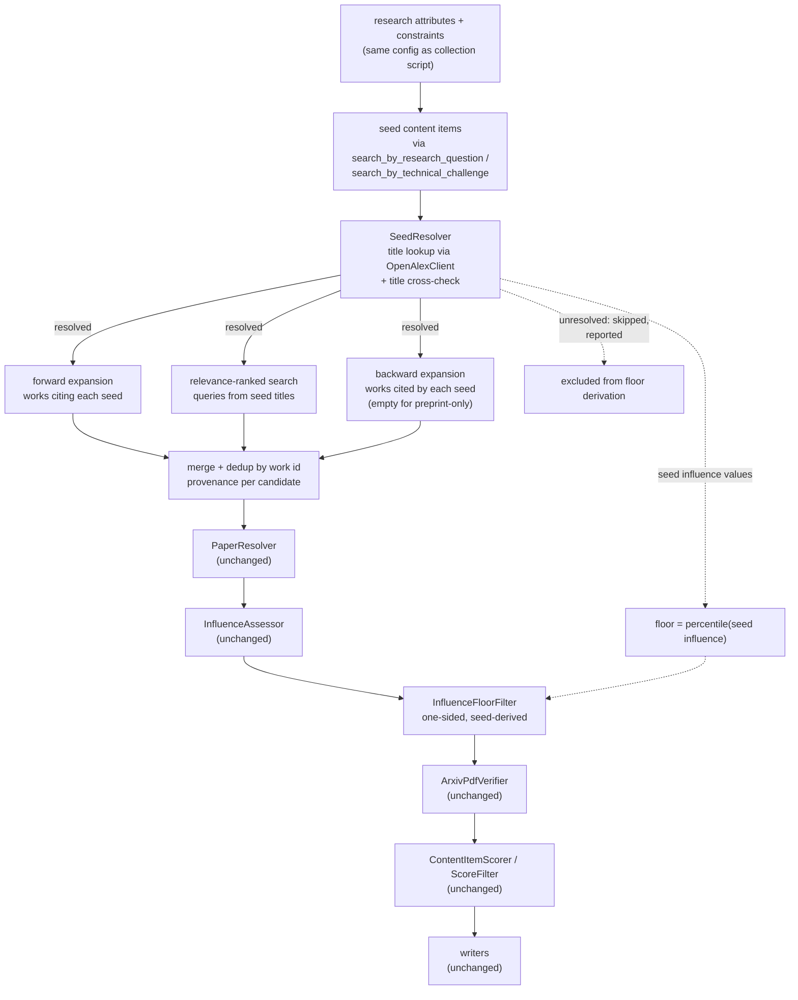

## Seed-based paper expansion

### 1. Executive summary

#### 1.1 Spec description

Given the same research attribute input as the existing collection script, seed candidates are
generated from the content items already stored as relevant to those attributes: works that cite
each seed, works cited by each seed, and results of a relevance-ranked search built from the
seeds' titles. Candidates from all three generators are merged and de-duplicated, resolved and
assessed for influence exactly as a discovered candidate already is, then dropped if their
influence falls below a floor derived from the seed set itself, before being scored and written
alongside every other paper. The script that runs this — `collect_influential_papers_from_seeds`
— reaches a different, wider set of papers than an agent driven purely by web search can, because
it works forward and backward through the citation graph of papers already confirmed relevant.

#### 1.2 Spec motivation

A web-search agent depends on already knowing good search terms, and its result set is bounded by
what a handful of searches surface. Once even a few relevant papers exist in the database, the
citation graph around them is a far richer source: the works that cite a good paper and the works
it itself cites are frequently on-topic in a way no keyword query guarantees, and neither direction
is reachable by searching. This script is only useful once the database holds seeds to expand
from, which is why it runs after papers already exist rather than replacing the search-driven path.

#### 1.3 Implementation repos

- `mourat` (this repo) — the API client extensions, the seed-expansion component, the influence
  floor filter, the script and configs, and tests.

### 2. Requirement analysis

#### 2.1 Functional requirements

1. **Seed loading** — the script reads, for the same configured research attributes and
   constraints as the collection script, the content items already stored as relevant to them,
   using the existing `search_by_research_question` / `search_by_technical_challenge` query
   functions. Each seed's title is what identifies it going forward; the script does not require
   any stored identifier beyond the content item's own attributes. The script must remain usable
   when the seed set is small, and must report clearly when it is empty rather than proceeding as
   if it had candidates.
2. **Three candidate generators** — (a) **forward citation-graph expansion**: works that cite each
   seed; (b) **relevance-ranked API search**: results of a search built from each seed's title,
   paged up to a configurable budget; (c) **backward citation-graph expansion**: works cited by
   each seed, surfacing the foundational literature the seeds build upon rather than the
   derivative work found by (a). Candidates from all three are merged and de-duplicated by the
   metadata API's own work id, and each merged candidate's provenance names every generator that
   produced it. Generator (c) is opportunistic: the metadata API reports no reference list for
   records that exist only as preprints, so an empty result from it for such a seed is not an
   error.
3. **Relevance-ranked search, never citation-ranked** — generator (b) retrieves candidates in
   relevance order. Sorting search results by citation count is prohibited, since it returns
   highly-cited works unrelated to the query rather than on-topic ones.
4. **Seed-derived influence floor** — each merged candidate is resolved and assessed for influence
   by the same resolver and assessor the collection script already uses. A candidate is then
   dropped unless its normalised influence reaches a floor derived from the normalised influence of
   the seed set itself, by a configurable rule, so that the papers already judged relevant and
   influential define the bar empirically. The floor is one-sided: a candidate far above it is a
   better result, never a rejection.
5. **Shared scoring and output** — candidates that pass the floor are scored, filtered and written
   exactly as the collection script's candidates are, so a paper discovered by expansion and a
   paper discovered by web search are indistinguishable once stored, aside from their recorded
   provenance.

#### 2.2 Non-functional requirements

1. **No credentialed API dependency**: every additional API call this script makes uses the same
   unauthenticated metadata API the collection and resolution work already depends on. No
   component requires an API key.
2. **Bounded external cost**: every candidate-generating loop — search paging, per-seed forward
   expansion, per-seed backward expansion — is bounded by a configurable budget, so a large seed
   set cannot cause unbounded querying.
3. **Idempotent**: running the script twice over the same seed set does not create duplicate
   content items, inheriting the upserting behaviour the collection script's writer already
   provides.
4. **Config-driven, with observable provenance**: all budgets and the floor derivation rule come
   from Hydra config; no hardcoded values in code. Monitoring records, per candidate, which
   generator or generators produced it, its normalised influence, and the reason it was dropped
   below the floor; a seed that fails to resolve is reported and skipped rather than silently
   excluded from expansion. Logging follows the established pattern.

### 3. Acceptance criteria

Unit tests mock all external I/O: metadata API responses via a mocked HTTP client (as in
`tests/test_collectors.py`). Seed loading tests run against a temporary database with the schema
applied and seeded content items. No test performs a real network request, and no test asserts
against a live API's ranking or field values.

- **FR1 (seed loading):** test that the script resolves the same configured research attribute
  ids as the collection script and retrieves the content items already linked to them; test that
  the script completes and reports the condition when the seed set is empty; test that a small
  seed set (one item) still produces a run rather than being rejected.
- **FR2 (three candidate generators):** tests per generator against mocked API responses — forward
  expansion returns the citing works of each seed; relevance-ranked search returns the paged
  results built from seed titles; backward expansion returns the cited works of a seed that has a
  reference list, and an empty result without error for a seed that has none. A merge test asserts
  that a work returned by more than one generator appears once in the merged output, and that its
  recorded provenance names every generator that produced it.
- **FR3 (relevance-ranked search, never citation-ranked):** test that the search request carries
  no citation-count sort parameter; test that paging stops at the configured budget when the
  mocked API offers further pages.
- **FR4 (seed-derived influence floor):** test that a merged candidate is resolved and assessed via
  the existing resolver and assessor before the floor is applied; test that the floor derived from
  a seed set admits a candidate above it and rejects one below it; test that a candidate far above
  the floor is retained; test that the derivation rule is taken from config; test that a seed which
  fails to resolve is reported and excluded from the floor's derivation rather than silently
  contributing a default value.
- **FR5 (shared scoring and output):** test that a candidate passing the floor reaches the same
  scorer, filter and writers the collection script uses, with its provenance carried through to the
  written record; integration test against a temporary database verifying a candidate above the
  floor is stored with its generator provenance recorded.
- **NFR1 (no credentialed API dependency):** manual verification that the script runs to
  completion with no API credentials configured beyond the LLM.
- **NFR2 (bounded external cost):** covered by the FR3 paging-budget test, plus a test that
  per-seed forward and backward expansion each stop at their configured candidate budget.
- **NFR3 (idempotent):** integration test that running the script twice over the same seed set and
  mocked API responses creates no duplicate content item, exercising the same upsert path the
  collection script's writer already provides.
- **NFR4 (config-driven, with observable provenance):** test composing the script's config and
  asserting every component instantiates; test that monitoring text for the candidate stage names
  the generator(s) and normalised influence per candidate and states the reason for every candidate
  dropped below the floor and every seed skipped for failing to resolve. Manual verification of the
  log file for step timings.

### 4. Insight

#### 4.1 Seed identity resolution

Because seed loading (FR1) reads content items that carry no metadata-API identifier, and FR2's
expansion generators need one per seed to query the citation graph.

**Idea A: re-resolve each seed at the start of the run.** Look each seed up by title through the
same resolver already used for discovered candidates, applying the same title cross-check.

Pros: no schema change; a stored seed has a clean canonical title, since it already passed the
title cross-check once to be stored at all, so it resolves at least as reliably as a freshly
discovered candidate; reuses the resolver already required.
Cons: one lookup per seed on every run, and a seed that resolves wrongly expands from the wrong
neighbourhood.

**Idea B: persist the metadata API identifier on the content item.** Add a column and read it
back.

Pros: exact, no re-resolution, no ambiguity.
Cons: requires a schema change nothing else in this feature calls for, and binds every stored
content item to one metadata provider's identifier space — including posts, which have no
OpenAlex identity at all.

**Choice: Idea A.** A seed re-resolving wrongly is reported and skipped rather than expanded from
(FR4's floor-derivation criterion already requires this), so the failure is visible rather than
silent. The mis-resolution risk is accepted for the same reason it was accepted when resolving a
freshly discovered candidate: the alternative is a schema change with a much wider blast radius
than one script needs.

#### 4.2 Floor derivation rule

**Idea A: a percentile of the seed set's normalised influence.** The floor is the value below
which a configured percentage of the seed set's own influence scores fall — for example, the 10th
percentile.

Pros: derives directly from the empirical distribution of papers already judged both relevant and
influential; adapts automatically to a topic's citation norms, since the seeds themselves carry
that context; one configured percentage, easy to reason about.
Cons: a very small seed set makes a percentile unstable — three seeds give only four meaningfully
distinct percentile positions.

**Idea B: the minimum of the seed set's influence.** The floor is the lowest normalised influence
among the seeds.

Pros: simplest possible rule; no configuration beyond choosing it.
Cons: a single unusually low-influence seed (which passed on relevance, not influence — the
collection script never filters on influence) sets the floor for every candidate, admitting
mediocre papers the seed set itself wouldn't be judged to represent.

**Idea C: a fixed multiple of the seed set's mean influence.** The floor is the seed mean scaled
by a configured factor below 1.

Pros: uses the whole seed set rather than one order statistic, so a single outlier has bounded
effect.
Cons: a mean is pulled hard by one very high-influence seed in a small set, which can push the
floor above candidates that are perfectly reasonable relative to the bulk of the seeds.

**Choice: Idea A.** Idea B is fragile to exactly the failure mode this floor exists to avoid — one
weak seed setting the bar for everything. Idea C's mean-sensitivity is a milder version of the same
problem. A percentile is the only one of the three that is both empirically grounded and robust to
a single extreme seed, at the cost of needing a documented minimum seed-set size below which the
derived floor is unreliable — a cost worth naming in config documentation rather than solving with
a special case in code.

### 5. Overall solution design

#### 5.1 High-level design

The candidate generators and the floor are the only new pipeline stages; everything from
resolution onward is the same components a discovered candidate already passes through, run again
over a different candidate source. `InfluenceFloorFilter` sits after `InfluenceAssessor` and before
`ArxivPdfVerifier`, because a floor is meaningless before influence is assessed, and dropping
candidates before the PDF probe means the most expensive deterministic check in the pipeline is
never spent on a paper the floor would reject anyway — the only ordering decision this spec makes
that differs from resolution's, since resolution had no filter to place.

#### 5.2 Core components

Every component is a `Function[InputT, OutputT]` subclass instantiated via
`hydra.utils.instantiate(cfg.x)(monitoring_handler, ...)` with `_partial_: true`.

- **`mourat.clients.openalex.OpenAlexClient`** — extended, not replaced: cursor-paged search,
  forward-citation query and reference-list query are added to the title search and single-work
  lookup it already exposes. Same client, same request policy.
- **`mourat.resolvers.seed_resolver.SeedResolver`** — `Function[ContentItemCollection, SeedCollection]`.
  Resolves each stored content item to a metadata work id by title via `OpenAlexClient`, applying
  the same title cross-check `PaperResolver` uses; reports and skips a seed that fails it, per 4.1.
  Also computes and exposes the seed set's influence distribution for the floor.
- **`mourat.collectors.seed_expander.SeedExpander`** — `Function[SeedCollection, PaperCandidateCollection]`.
  Runs the three generators of FR2 against `OpenAlexClient`, applies per-generator budgets, merges
  and de-duplicates by work id, and records on each candidate which generators produced it.
- **`mourat.filters.InfluenceFloorFilter`** — `Function[ResolvedPaperCollection, ResolvedPaperCollection]`.
  The one-sided, seed-derived floor of FR4, applied after `InfluenceAssessor` and before
  `ArxivPdfVerifier`. Monitoring leads with dropped candidates and their influence values, per the
  project's filter convention.
- **`collect_influential_papers_from_seeds`** — the entry point: loads research attributes and
  constraints, retrieves seed content items, composes `SeedResolver` → `SeedExpander` →
  `PaperResolver` → `InfluenceAssessor` → `InfluenceFloorFilter` → `ArxivPdfVerifier` → the scorer,
  filter and writers already used by the collection script.

#### 5.3 Data models

- **`Seed`** — `content_item_id`, `work_id`, `title`, `influence_value`. **`SeedCollection`** wraps
  them.
- **`ContentItemCollection`** — a collection wrapper for the existing `ContentItem` model, which
  currently has none, so that `SeedResolver` can take a proper Pydantic collection as its input
  type.
- **`PaperCandidate`** gains a `provenance: list[str]` field, populated with generator names by
  `SeedExpander` and left as a single web-search entry by the existing discovery agent, so
  provenance is visible at the same point in the pipeline for candidates from either source.

#### 5.4 Configuration

One main config, `config/config_collect_influential_papers_from_seeds.yaml`, a `defaults:` list
composing `monitoring_handler`, the scoring LLM alias, and one config group file per new component,
plus reusing the resolution and output component configs from the collection script's `defaults:`
list. Per-generator budgets, the floor percentile and the research attribute ids are config values;
`db_path` comes from `user_settings` as in the existing scripts.

### 6. Implementation plan

#### 6.1 Todo list

Phases are ordered by real dependency: the client extension and the new data model fields settle
before the components that consume them, and the seed-resolution/expansion path is built before
it's wired into the script.

**Phase 1 — foundations**

1. **Extend `OpenAlexClient`** — add cursor-paged search, a forward-citation query and a
   reference-list query to the existing title search and single-work lookup. Tests use a mocked
   HTTP client.
2. **Add `Seed(Collection)` and `ContentItemCollection`** to `data_models.py`; add
   `provenance: list[str]` to `PaperCandidate`, defaulted so the existing discovery agent's output
   still validates without setting it explicitly.

**Phase 2 — seed resolution and expansion**

3. **Write `SeedResolver`** — title lookup via `OpenAlexClient`, the shared title cross-check,
   reporting and skipping a seed that fails it, and computing the seed influence distribution.
4. **Write `SeedExpander`** — the three generators, per-generator budgets, merge and dedup by work
   id, provenance recorded per candidate.
5. **Write `InfluenceFloorFilter`** — the one-sided percentile floor of 4.2, monitoring leading
   with dropped candidates and their influence values.

**Phase 3 — the script**

6. **Write `collect_influential_papers_from_seeds`** — load research attributes and constraints,
   retrieve seed content items via `search_by_research_question` / `search_by_technical_challenge`,
   then compose seed resolver → expander → the existing resolver, assessor, floor filter, verifier,
   scorer, filter and writers.
7. **Write its config** — the main config plus the new component group files, reusing the
   collection and resolution scripts' existing group files by reference.

**Phase 4 — verification**

8. **Write the tests** — every criterion in section 3.
9. **Run the full suite and the linters** — `pytest`, then `black --check`, `isort --check`,
   `pylint` (errors only) and `mypy` scoped per file, invoked as `python -m ...` from the project
   venv.
10. **Manual verification** — run the script against the same research question used to verify the
    collection and resolution scripts, once they hold at least one stored paper each. Inspect
    monitoring for the derived floor value and per-candidate provenance, confirm papers arrive from
    more than one generator across a real run where possible, and confirm no duplicate content
    items after a second run.

#### 6.2 Modification summary

| File | Action |
|------|--------|
| `mourat/clients/openalex.py` | Modified: add cursor-paged search, forward-citation and reference-list queries |
| `mourat/data_models.py` | Modified: add `Seed(Collection)`, `ContentItemCollection`; `PaperCandidate` gains `provenance` |
| `mourat/resolvers/seed_resolver.py` | New: `SeedResolver` |
| `mourat/collectors/seed_expander.py` | New: `SeedExpander` |
| `mourat/filters.py` | Modified: add `InfluenceFloorFilter` |
| `mourat/scripts/collect_influential_papers_from_seeds.py` | New: entry point |
| `config/config_collect_influential_papers_from_seeds.yaml` | New: main config |
| `config/seed_resolver/default.yaml` | New: component config |
| `config/seed_expander/default.yaml` | New: component config |
| `config/influence_floor_filter/default.yaml` | New: component config |
| `tests/test_clients.py` | Modified: add the three new `OpenAlexClient` query tests |
| `tests/test_resolvers.py` | Modified: add `SeedResolver` tests |
| `tests/test_collectors.py` | Modified: add `SeedExpander` tests |
| `tests/test_filters.py` | Modified: add `InfluenceFloorFilter` tests |
| `tests/test_imports.py` | Modified: import tests for every new module |
