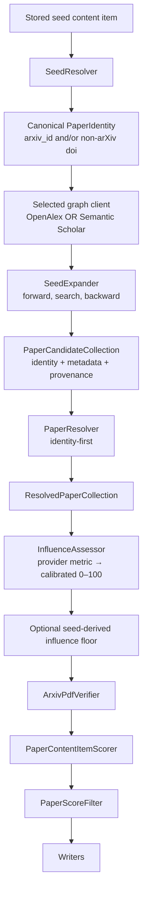

## Provider-generalized seed expansion

### 1. Executive summary

#### 1.1 Spec description

The seed-based paper-expansion pipeline will support interchangeable metadata and citation-graph clients, initially OpenAlex and Semantic Scholar, without changing the downstream candidate-processing stages. A common client contract will expose paper resolution by canonical arXiv ID or DOI, relevance search, forward citations, and backward references while hiding provider-specific identifiers, response shapes, pagination, authentication, proxy, and retry policies. Seeds and candidates will carry only canonical paper identity fields: an arXiv ID and/or a non-arXiv DOI; the DOI `10.48550/arXiv.<id>` will canonicalize to the arXiv ID and will not populate the DOI field. The existing Semantic Scholar collector will be split so its reusable API client lives under `mourat/clients`, while its pipeline-stage adapter remains under `mourat/collectors`.

The selected client will be configurable per run. Candidates discovered through either client will retain canonical identity, generator provenance, and normalized bibliographic metadata, allowing the existing resolution, influence assessment, PDF verification, relevance scoring, filtering, and writing stages to consume them without provider-specific branches. Influence assessment will map provider-specific raw metrics through provider-specific calibrated breakpoints onto the shared 0–100 scale; the existing seed-derived influence floor will then operate on those normalized scores, provided that the selected configuration supplies the corresponding calibrated metric and breakpoints.

#### 1.2 Spec motivation

The current `SeedExpander` and `SeedResolver` are hardcoded to OpenAlex identifiers, response fields, pagination, and citation endpoints. OpenAlex does not provide adequate citation-graph coverage for arXiv-dominated AI literature, particularly forward citations to and backward references from preprints, while Semantic Scholar is a viable alternative when accessed through the configured proxy and authenticated API. Without a provider-neutral boundary, adding Semantic Scholar would either duplicate the expansion pipeline or discard Semantic Scholar identities and resolve the results back through OpenAlex title search.

#### 1.3 Implementation repos

- `/home/tony/reps/github/anton-pershin/mourat`

### 2. Requirement analysis

#### 2.1 Functional requirements

- **FR1 — Selectable graph client:** The seed-based pipeline shall support selecting either OpenAlex or Semantic Scholar as its metadata and citation-graph client through configuration, without changing the pipeline script.

- **FR2 — Common graph operations:** Each supported client shall provide normalized operations for:
  - resolving a paper by arXiv ID;
  - resolving a paper by DOI;
  - searching papers by text;
  - retrieving forward citations;
  - retrieving backward references.

- **FR3 — Canonical paper identity:** Seeds, candidates, and resolved papers shall carry only canonical identity fields:
  - `arxiv_id`;
  - `doi`, excluding the DOI namespace `10.48550/arXiv.*`.

  Provider-specific identifiers shall not appear in pipeline data models.

- **FR4 — Identifier canonicalization:** The pipeline shall normalize arXiv identifiers and DOI values. A value matching `10.48550/arXiv.<id>` shall produce the corresponding `arxiv_id` and leave `doi` unset.

- **FR5 — Identity-first resolution:** The paper resolver shall resolve candidates by arXiv ID first, then by DOI, and use title search only when neither canonical identifier is available.

- **FR6 — Provider-neutral seed expansion:** The seed expander shall perform forward-citation, relevance-search, and backward-reference generation through the selected client, merge results, deduplicate them by canonical identity, and retain all generator provenance.

- **FR7 — Normalized paper records:** Both clients shall convert provider-specific responses into a common paper-record shape containing, where available, title, authors, abstract, publication date, canonical identifiers, citation data, and provider-neutral raw influence fields required by the configured assessor.

- **FR8 — Influence normalization:** Provider-specific raw influence metrics shall be mapped to the shared `0–100` `influence_score` through separately configurable breakpoint sets calibrated to the common influence interpretation. The seed-derived influence floor shall operate on these normalized scores.

- **FR9 — Semantic Scholar client extraction:** Reusable Semantic Scholar API functionality shall be implemented as a plain client under `mourat/clients`; the existing Semantic Scholar pipeline collector shall remain a `Function` adapter using that client.

- **FR10 — Existing OpenAlex preservation:** The existing OpenAlex expansion path shall remain available through the common client contract.

#### 2.2 Non-functional requirements

- **NFR1 — Provider isolation:** Provider-specific identifiers, endpoint details, response formats, pagination, authentication, proxy configuration, request pacing, retry, and rate-limit handling shall remain inside the corresponding client.

- **NFR2 — Bounded retries:** Transient failures, including HTTP 429 and 5xx responses, shall be retried with bounded exponential backoff; retry exhaustion shall produce a visible failure rather than an infinite loop.

- **NFR3 — Configuration-driven behavior:** Client selection, API credentials, proxy settings, request limits, retry policy, generator budgets, and influence breakpoints shall be configurable without code changes.

- **NFR4 — Stable downstream contracts:** Replacing OpenAlex with Semantic Scholar shall not require provider-specific branches in downstream resolution, PDF verification, relevance scoring, filtering, or writing stages.

- **NFR5 — Verifiable provenance:** Monitoring output shall distinguish the selected client, generator provenance, unresolved identities, unsupported/empty graph results, and influence metrics used.

- **NFR6 — Test isolation:** Unit tests shall mock client operations and shall not make real OpenAlex, Semantic Scholar, arXiv, or proxy requests.

### 3. Acceptance criteria

All client, resolver, and expander tests shall use mocked HTTP responses or mocked client methods; no test shall make a real network request.

- **AC1 (FR1):** Running the seed pipeline with an OpenAlex client configuration and with a Semantic Scholar client configuration instantiates the corresponding client and executes the same pipeline entry point.

- **AC2 (FR2):** Contract tests for both clients cover arXiv lookup, DOI lookup, text search, forward citations, and backward references, and verify that each returns the normalized result shape.

- **AC3 (FR3):** Model tests demonstrate that seeds, candidates, and resolved papers expose `arxiv_id` and `doi` but no OpenAlex- or Semantic-Scholar-specific identifier field.

- **AC4 (FR4):** Canonicalization tests map `10.48550/arXiv.1706.03762` to `arxiv_id="1706.03762", doi=None`, normalize equivalent arXiv forms consistently, and preserve an unrelated DOI as `doi`.

- **AC5 (FR5):** Resolver tests verify the call order arXiv ID → DOI → title search, and verify that title search is not called when a canonical identifier resolves successfully.

- **AC6 (FR6):** Expander tests verify all three generators, independent per-generator budgets, canonical-identity deduplication, and preservation of multiple generator provenance values for one candidate.

- **AC7 (FR7):** Fixture-based tests show that representative OpenAlex and Semantic Scholar responses produce equivalent normalized paper records when they describe the same paper, including arXiv/DOI aliases and influence inputs where supplied.

- **AC8 (FR8):** Influence tests verify that different provider metrics use different configured breakpoint sets, produce scores in `0–100`, and feed the normalized scores into the existing seed-derived percentile floor; a candidate above the floor is retained even when it is far above the seed distribution.

- **AC9 (FR9):** Import and adapter tests verify that `SemanticScholarClient` is a plain client, `SemanticScholarPaperCollector` remains a `Function`, and the collector delegates API work to the client while preserving its existing output contract.

- **AC10 (FR10):** Existing OpenAlex client and seed-expansion tests remain green, and an OpenAlex-configured pipeline produces the same normalized candidate behavior as before for equivalent mocked responses.

- **AC11 (NFR1):** Client tests verify that provider-specific pagination, internal lookup IDs, authentication, proxy settings, and retry handling are not passed into normalized pipeline models or expander logic.

- **AC12 (NFR2):** Retry tests verify bounded exponential backoff for 429 and 5xx responses, successful recovery before the retry limit, and a visible exception or recorded failure after exhaustion.

- **AC13 (NFR3):** Configuration tests instantiate both clients with different endpoints, credentials, proxy settings, budgets, retry settings, and influence breakpoints without source changes.

- **AC14 (NFR4):** A mocked Semantic Scholar run reaches paper resolution, PDF verification, scoring, filtering, and writing through the same downstream component interfaces used by an OpenAlex run.

- **AC15 (NFR5):** Monitoring tests verify reporting of the selected client, generator provenance, unresolved or unsupported graph results, and the metric used for each assessed influence score.

- **AC16 (NFR6):** The test suite contains no live requests to OpenAlex, Semantic Scholar, arXiv, or the proxy; network-dependent client behavior is covered by mocked HTTP responses.

- **AC17 — AWQ end-to-end provider smoke test:** Using the existing database item `paper_awq_activation_aware_weight_quantization_for_llm_compression_and_acceleration` as the sole seed, run the complete seed-expansion pipeline once with OpenAlex and once with Semantic Scholar. Each run shall resolve the seed from its arXiv URL (`arXiv:2306.00978`), obtain at least one candidate through a graph/search generator, preserve canonical `arxiv_id`/DOI identity and generator provenance, resolve candidates without title-only fallback when an identity is available, complete influence assessment and the configured influence-floor decision, and reach the final output writer without provider-specific errors.

The live test report shall record, for each provider, seed resolution, forward candidates, search candidates, backward candidates, merged candidates, resolved candidates, influence metric and scores, floor value and kept/dropped counts, and final written candidates. It is a manual acceptance test rather than an ordinary automated test: OpenAlex uses real requests, Semantic Scholar uses the configured proxy and API key, and the test is not part of the regular unit-test suite. A legitimately empty generator is acceptable, but the report shall distinguish an empty result from a request or client failure.

### 4. Insight

#### 4.1 Client boundary

- **Alternative A — Common normalized client contract:** OpenAlex and Semantic Scholar implement the same identity-based operations and return normalized paper records and pages. The expander and resolvers depend only on that contract.
- **Alternative B — Provider-specific adapters inside the expander:** The expander contains branches for OpenAlex and Semantic Scholar and translates each response itself.

**Choice:** Alternative A. It keeps provider details isolated, makes the AWQ provider comparison meaningful, and avoids duplicating expansion logic.

#### 4.2 Paper identity

- **Alternative A — Canonical arXiv ID and DOI only:** Pipeline models carry `arxiv_id` and `doi`; provider-internal IDs remain inside clients.
- **Alternative B — Add provider-specific IDs to the models:** Store OpenAlex and Semantic Scholar IDs alongside arXiv ID and DOI.

**Choice:** Alternative A. Both selected providers can resolve by arXiv ID and DOI, so provider IDs are implementation details rather than pipeline identity.

#### 4.3 Provider selection

- **Alternative A — One selected client per run:** Seed resolution, expansion, and metadata resolution use one configured provider.
- **Alternative B — Union multiple providers in one run:** OpenAlex and Semantic Scholar results are combined during expansion.

**Choice:** Alternative A for this spec. It minimizes identity reconciliation and conflicting metadata; multi-provider union can be added after the common contract is validated.

#### 4.4 Influence normalization

- **Alternative A — Provider-specific raw metrics with calibrated breakpoints:** Each provider maps its metric to the shared 0–100 scale; the existing percentile floor consumes the normalized scores.
- **Alternative B — Use one universal raw metric:** Convert every provider response to a single raw metric, such as citations per year, before normalization.
- **Alternative C — Disable the influence floor for new providers:** Record provider scores but never use them for filtering until separately implemented.

**Choice:** Alternative A. It preserves the existing floor behavior while acknowledging that FWCI and citation-based metrics require different calibrated breakpoints. The floor algorithm itself remains provider-neutral because it receives normalized scores.

#### 4.5 Semantic Scholar integration

- **Alternative A — Extract a plain client and retain a thin collector adapter:** Move HTTP, authentication, proxy, rate limiting, retries, pagination, and parsing into `mourat/clients/semantic_scholar.py`; keep `SemanticScholarPaperCollector` as a `Function` adapter.
- **Alternative B — Replace the collector with a client and update all callers:** Remove the pipeline-stage adapter and make scripts call the client directly.

**Choice:** Alternative A. It preserves the existing collector pipeline contract while making Semantic Scholar functionality reusable by seed resolution and expansion.

#### 4.6 Candidate resolution

- **Alternative A — Identity-first resolution:** Resolve by arXiv ID, then DOI, and use title search only when no canonical identity exists.
- **Alternative B — Always resolve by title through the selected provider:** Treat identifiers as metadata only and repeat title lookup.

**Choice:** Alternative A. It avoids losing the identity returned by graph expansion and prevents provider search ranking from silently selecting a different paper.

### 5. Overall solution design

#### 5.1 High-level design

The selected graph client is used by seed resolution, expansion, and candidate metadata resolution. Provider-specific identifiers and API mechanics remain inside that client. The influence assessor receives provider-specific raw metric fields and configured breakpoints, but emits the existing normalized `influence_score`; the optional floor therefore remains a generic downstream stage.

#### 5.2 Core components

- **`PaperIdentity`, `PaperRecord`, `PaperPage`, and `PaperGraphClient`** — common client-facing identity, normalized result models, pagination model, and contract, defined in `mourat/clients/paper_graph.py`.
- **Pipeline data models** — `Seed`, `PaperCandidate`, and `ResolvedPaper` in `mourat/data_models.py` carry canonical identity fields and normalized influence inputs, but no provider-specific IDs.
- **`OpenAlexClient`** — existing client adapted to the common contract; OpenAlex work IDs, field names, cursors, and request policy remain internal.
- **`SemanticScholarClient`** — new plain client under `mourat/clients`; owns Graph API calls, API-key and proxy configuration, pagination, rate limiting, bounded retries, response normalization, and internal Semantic Scholar IDs.
- **`SemanticScholarPaperCollector`** — existing `Function` adapter retained under `mourat/collectors`; delegates search and conversion to `SemanticScholarClient` while preserving its pipeline output.
- **`SeedResolver`** — resolves stored seed items through the selected client, preferring an arXiv ID extracted from the stored URL and otherwise using a DOI or title lookup; outputs canonical seeds.
- **`SeedExpander`** — runs the three bounded generators through the selected client, merges by canonical identity, and records generator provenance.
- **`PaperResolver`** — resolves candidates by arXiv ID, then DOI, then title only as a final fallback; maps normalized client records into `ResolvedPaper`.
- **`InfluenceAssessor`** — maps the selected provider's configured raw metric through its calibrated breakpoints to the shared 0–100 score.
- **`InfluenceFloorFilter`** — derives a percentile floor from normalized seed scores and filters candidates below it when enabled.
- **Existing downstream stages** — `ArxivPdfVerifier`, paper scorer, score filter, and writers consume the same resolved/scored collection contracts and do not branch on provider.

#### 5.3 Data-model boundaries

Persisted content-item attributes remain unchanged. The following identity and influence fields are in-flight pipeline data:

- `arxiv_id: str | None`;
- `doi: str | None`, excluding `10.48550/arXiv.*`;
- normalized title, authors, abstract, and publication date;
- provider-independent provenance and generator provenance;
- raw influence inputs, normalized `influence_score`, and `influence_measure_used`.

No OpenAlex work ID or Semantic Scholar paper ID is carried by `Seed`, `PaperCandidate`, or `ResolvedPaper`. A client may cache such IDs privately while performing a request.

#### 5.4 Hydra configuration

The seed-based pipeline selects one graph client instance per run. `SeedResolver`, `SeedExpander`, and `PaperResolver` receive that same instance, so provider-level caches, pacing, retry state, and rate limiting are shared consistently. OpenAlex and Semantic Scholar group configurations define their own endpoint, credential, proxy, pacing, retry, pagination, and response-field settings. Generator budgets remain in the seed-expander configuration. Influence-assessor configurations define the provider metric and its calibrated breakpoints; the influence-floor configuration controls whether the normalized-score floor is enabled and its percentile.

### 6. Implementation plan

#### 6.1 Todo list

The work is ordered by dependency: first define the shared identity and normalized client contracts; then implement and test Semantic Scholar and adapt OpenAlex; then migrate the resolver and expander; finally wire Hydra, preserve the existing collector path, and run the live AWQ comparison.

1. Add canonical identity normalization for arXiv IDs, ordinary DOIs, and `10.48550/arXiv.*` aliases.
2. Add the common client-facing paper-record and pagination models in `mourat/clients/paper_graph.py` without exposing provider-specific IDs.
3. Define the common graph-client contract and update client exports.
4. Extract `SemanticScholarClient` from the existing collector, including API-key/proxy configuration, pagination, bounded 429/5xx retry, and normalized responses.
5. Adapt `OpenAlexClient` to the common contract while preserving its existing cursor and request behavior.
6. Add client contract tests and response fixtures for both providers.
7. Generalize `Seed`, `PaperCandidate`, and `ResolvedPaper` to carry canonical identities and normalized influence inputs.
8. Generalize `SeedResolver` to use the selected client and identity-first resolution.
9. Generalize `SeedExpander` to use the selected client, canonical-identity deduplication, generator budgets, and provenance.
10. Generalize `PaperResolver` to resolve by arXiv ID, DOI, and only then title fallback.
11. Update influence-assessor configuration and tests for provider-specific raw metrics and calibrated breakpoint sets while retaining the shared normalized score and percentile floor.
12. Rewrite `SemanticScholarPaperCollector` as a thin client-backed `Function` adapter and preserve its existing script output contract.
13. Update Hydra composition so the seed resolver, expander, and paper resolver use the selected client, with selectable OpenAlex and Semantic Scholar configurations.
14. Add mocked pipeline-chain tests covering both client selections and the downstream provider-neutral stages.
15. Run the manual AWQ end-to-end acceptance test once per provider and record the required per-provider report.

#### 6.2 Modification summary

| File | Action |
|------|--------|
| `mourat/data_models.py` | Modified: add canonical identity, normalized paper-record/page models, and carry canonical IDs/raw influence inputs through seed, candidate, and resolved-paper models. |
| `mourat/clients/paper_graph.py` | New: common graph-client contract and normalized client-facing `PaperIdentity`, `PaperRecord`, and `PaperPage` models. |
| `mourat/clients/semantic_scholar.py` | New: Semantic Scholar Graph API client with authentication, proxy, pagination, rate limiting, retries, and normalization. |
| `mourat/clients/openalex.py` | Modified: implement the common client contract while preserving OpenAlex behavior. |
| `mourat/clients/__init__.py` | Modified: export the common contract and Semantic Scholar client. |
| `mourat/collectors/semantic_scholar.py` | Modified: retain the pipeline collector as a thin adapter over the new client. |
| `mourat/collectors/seed_expander.py` | Modified: remove OpenAlex-specific operations and use the common client, canonical identity, and normalized records. |
| `mourat/resolvers/seed_resolver.py` | Modified: use the selected client and identity-first resolution. |
| `mourat/resolvers/paper_resolver.py` | Modified: resolve by canonical identity before title fallback and consume normalized records. |
| `mourat/processors/influence_assessor.py` | Modified: accept provider-specific metric inputs and configured calibrated breakpoints without changing the normalized score contract. |
| `mourat/scripts/collect_influential_papers_from_seeds.py` | Modified: instantiate and pass the selected client consistently through the seed pipeline. |
| `config/clients/openalex.yaml` | New: OpenAlex common-client configuration. |
| `config/clients/semantic_scholar.yaml` | New: Semantic Scholar endpoint, API key, proxy, pacing, pagination, and retry configuration. |
| `config/seed_resolver/default.yaml` | Modified: replace the OpenAlex-only dependency with the selected graph client. |
| `config/seed_expander/default.yaml` | Modified: replace `openalex_client` with the common selected client and retain generator budgets. |
| `config/paper_resolver/default.yaml` | Modified: replace the OpenAlex-only dependency with the selected graph client. |
| `config/config_collect_influential_papers_from_seeds.yaml` | Modified: compose the selectable graph client and provider-specific influence configuration. |
| `config/influence_assessor/default.yaml` | Modified: define the selected provider metric and calibrated breakpoints. |
| `config/influence_floor_filter/default.yaml` | Modified: expose explicit enable/disable behavior while retaining the percentile setting. |
| `tests/test_clients.py` | Modified: test common client behavior, provider normalization, identifier lookup, pagination, and bounded retries with mocked HTTP. |
| `tests/test_collectors.py` | Modified: test the generalized expander and the thin Semantic Scholar collector adapter. |
| `tests/test_resolvers.py` | Modified: test identity-first seed and paper resolution for both clients. |
| `tests/test_influence_assessor.py` | Modified: test provider-specific breakpoints and shared normalized scores. |
| `tests/test_paper_collection.py` | Modified: test the provider-selected pipeline chain and output contracts. |
| `tests/test_imports.py` | Modified: verify new client and adapter imports. |

#### 6.3 Out of scope

- Combining OpenAlex and Semantic Scholar results in one expansion run.
- Building a local arXiv citation graph or extracting references from arXiv PDFs/source.
- Adding database columns or tables for arXiv IDs, DOIs, OpenAlex IDs, or Semantic Scholar IDs.
- Persisting provider-specific identifiers in pipeline models or database records.
- Calibrating breakpoint values from a new empirical corpus; this spec wires configurable breakpoint sets and tests their use, while the selected values remain configuration data.
- Changing the existing downstream relevance-scoring, PDF-verification, filtering, or writer semantics beyond the interface adaptations required by canonical identities.
- Retiring the existing paper-collection scripts or unrelated collectors.
- Modifying `config/user_settings/user_settings.yaml` or any credentials file.

