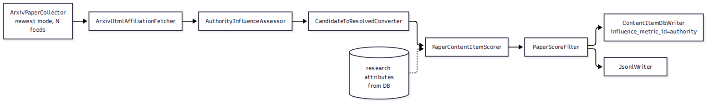

# Newest paper collection refactor with authority influence

### 1. Requirement analysis

## **R1.** The RSS collector (`ArxivPaperCollector`, `newest` mode) emits `PaperCandidateCollection` instead of `PaperInfoCollection`, mapping: title -> `title`, abstract -> `description`, link -> single element of `urls_seen`, arXiv id extracted from the link (version suffix stripped) -> `arxiv_id`, authors -> `authors`, published date -> `publication_date`. The collector fills `arxiv_id` deterministically from the feed url; no LLM is involved, so this does not breach the no-identifier-authority rule (which was about LLM agents inventing ids).

## **R2.** `PaperCandidate` gains an optional `publication_date: str | None = None` (ISO format string, mirroring `ResolvedPaper`). The discovery-agent path leaves it unset; the RSS collector fills it.

## **R3.** New `ArxivHtmlAffiliationFetcher`: for each candidate with an arXiv id, fetches `https://arxiv.org/html/<id>v1` and extracts author -> affiliation pairs from `ltx_role_affiliation` nodes. Papers whose HTML render is missing (HTTP error) or carries zero affiliation nodes get an explicit "affiliations unknown" state passed to the assessor. Fetching is paced and deterministic (no LLM).

## **R4.** New `AuthorityInfluenceAssessor`: a batched LLM classification stage mapping (authors, affiliations) -> a single 0-100 authority influence score per paper, judged against prompt-configured anchors (e.g. "100 = field-leading figure; 50 = active researcher at a reputable group; 0 = no recognisable authors or institutions"). Details:
- Batch size configurable (default 20-30), own LLM alias `@authority_llm`.
- Unmeasurable papers (LLM recognises nobody) score 0 (user ruling 2026-10-04).
- Verdict failure handling:
  - (1) transport error on the whole batch, (2) malformed response on the whole batch: bounded retry loop — same batch re-sent up to `request_retries` (default 3) with `request_retry_delay_seconds` (default 2.0) between attempts; after exhaustion every paper in the batch continues with score 0 and a logged warning naming the papers.
  - (3) verdict missing for a paper inside a valid response: one follow-up call containing only the missing papers (same retry loop applies to the follow-up); if that also fails, those papers continue with score 0 and a logged warning.
  - (4) verdict for an id not in the batch: silently discarded.
- Fail-open overall: a paper never receives a score that removes it from the pipeline; score 0 is stored, never a drop.

## **R5.** Rewritten `collect_newest_papers.py` pipeline: RSS collector (multiple feeds supported via per-feed group configs) -> relevance triage classifier (R9) -> affiliation fetch -> authority assessor -> `CandidateToResolvedConverter` -> `PaperContentItemScorer` -> `PaperScoreFilter` -> `ContentItemDbWriter` and `JsonlWriter` (independently enabled, pass-through). Research attributes (RQs, TCs, topics, constraints) loaded from the database, never hardcoded. The authority influence score is NOT a filter anywhere — it is stored only. A paper dropped by the triage classifier never receives affiliations, influence scores or relevance scores — it is absent from the run entirely.

## **R6.** Persistence is update-on-existing-id: when a paper's id already exists in the database from a previous run, the new run updates that existing row (overwrites scores and attribute links) instead of inserting a duplicate row or skipping the paper. Every run leaves the DB with one row per paper holding the newest scores. Id derivation must support both options: when the record carries an arXiv id, the stored id is derived from it (base id, version stripped); when it does not, the existing title-slug derivation applies unchanged. Other content paths have no arXiv id and must keep working.

## **R7.** The newest-papers path has one manual end-to-end test the user performs himself: run the rewritten `collect_newest_papers.py` against the live arXiv RSS feed (cs.LG) and verify by hand that (a) papers land in the database with relevance scores and authority influence scores, (b) affiliations appear in the monitoring artifacts for papers whose HTML render carries them, (c) a second run on the next day updates existing rows instead of duplicating them, (d) with the DB writer disabled the run produces the JSONL file. No automated test performs a live network request.

## **R8.** The RSS collector supports multiple category feeds: the main config lists one or more feed group configs; each feed's entries are collected into one combined `PaperCandidateCollection` before any downstream stage.

## **R9.** New `RelevanceTriageClassifier`: a true boolean classifier placed first after the collector. Given a batch of paper titles + abstracts and the attribute list (research questions, technical challenges, research topics — constraints excluded), it returns only per-paper true/false ("plausibly relevant to at least one attribute"), nothing else. Uses the same model as the scorer (`@scoring_llm` alias). Batched (20-30 papers per call, batch size configurable), verdicts matched back by id. Fail-open: a paper with no valid verdict (transport error, malformed response, missing verdict after bounded retries) is KEPT, never dropped. Monitoring reports counts in/kept/dropped plus the dropped papers' titles.

### 2. Tests

**T1 (R1).** `ArxivPaperCollector` in `newest` mode with a mocked RSS feed returns a `PaperCandidateCollection`; a sample entry maps correctly: title, abstract -> `description`, link in `urls_seen`, authors, ISO `publication_date`.

**T2 (R1).** A feed link `https://arxiv.org/abs/2501.12345v2` yields `arxiv_id="2501.12345"` (version suffix stripped).

**T3 (R2).** A `PaperCandidate` constructed without `publication_date` is valid (default None) — the discovery-agent path is unaffected. **T3b (R2).** A collector entry with a published date carries it through as an ISO string.

**T4 (R3).** With a mocked HTTP client returning an HTML page containing `ltx_role_affiliation` nodes, the fetcher maps each author to their affiliation.

**T5 (R3).** Affiliations-unknown variants: (a) HTTP 404 from the HTML render, (b) a render with zero affiliation nodes — both produce the explicit "affiliations unknown" state, not an exception.

**T6 (R4).** `FunctionModel` returns verdicts for all ids; every paper gets its score matched back by id; the number of LLM calls for a collection larger than the batch size asserts batch splitting.

**T7 (R4).** The model fn raises on every call -> after exhausting retries (count and delay asserted with mocked `time.sleep`), all papers in the batch continue with score 0; warnings logged with paper names.

**T8 (R4).** The model returns malformed JSON on every attempt -> same give-up behaviour as T7.

**T9 (R4).** The response omits one paper's verdict -> one follow-up call containing exactly that paper (call count asserted); the follow-up succeeds -> that paper gets its score; the others are not re-scored.

**T10 (R4).** The follow-up also fails -> that paper continues with score 0 + warning; others unaffected.

**T11 (R4).** The response contains a verdict for an id not in the batch -> discarded, no paper affected.

**T12 (R4).** "LLM recognises nobody" -> score stored as 0 (not None), paper continues.

**T13 (R5).** The config composes the full chain (RSS collector -> triage classifier -> fetcher -> assessor -> converter -> scorer -> filter -> both writers); attributes load from a fixture DB (assert the scorer receives them, not a hardcoded topic string). Mocked components, no network.

**T14 (R6).** Two sequential writer runs over the same paper id: after the second run there is exactly one row for the paper and its scores reflect the second run.

**T15 (R5).** Writer enable flags: with DB writer off and JSONL on, output lands in the JSONL file; with both off, nothing is written and no error is raised.

**T16 (R9).** All verdicts valid: every paper gets true/false matched back by id; batch splitting asserted for a collection larger than the batch size.

**T17 (R9).** Fail-open: model raises on every attempt -> after exhausted retries (asserted with mocked `time.sleep`), all papers in the batch are KEPT; warning logged.

**T18 (R9).** Malformed JSON on every attempt -> same keep-everything behaviour.

**T19 (R9).** Missing verdict for one paper in a valid response -> that paper is kept (fail-open), others get their verdicts.

**T20 (R9).** Verdict for an id not in the batch -> discarded.

**T21 (R9).** Constraints are not part of the classifier input even when the config supplies constraint ids (assert the classifier prompt contains no constraint text).

**T22 (R7).** Manual end-to-end test, performed by the user (see R7) — not part of the automated suite; the automated suite contains no live-network test.

### 3. Implementation plan

#### 3.1 Implementation repos

- `mourat` (`/home/tony/reps/github/anton-pershin/mourat`) — all implementation.

#### 3.2 High-level design

Pipeline (left to right; dashed edge = data dependency, not a stage):

RSS collector (newest mode, N feeds combined) -> RelevanceTriageClassifier (cheap batched boolean filter; saves downstream work) -> ArxivHtmlAffiliationFetcher -> AuthorityInfluenceAssessor -> CandidateToResolvedConverter -> PaperContentItemScorer (research attributes from DB) -> PaperScoreFilter -> ContentItemDbWriter and JsonlWriter in parallel (independently enabled, pass-through).

Ordering follows cheap-before-expensive: the boolean triage drops clearly irrelevant papers before the per-paper HTML fetch, the per-paper authority LLM call, and the per-attribute scoring. The converter sits after the assessor because the assessor works on the candidate lineage (which carries arxiv_id and affiliations); the tail stages consume the resolved shape.

#### 3.3 Todo list

1. [ ] Write the tests (T1-T22; T22 is the user's manual e2e, not written as a test)
2. [ ] Run all the tests and ensure that they fail
3. [ ] Add fields to `PaperCandidate`: `publication_date: str | None`, `influence_score: int | None`, `affiliations: dict[str, list[str]] | None` (in-flight)
4. [ ] Refactor `ArxivPaperCollector` to emit `PaperCandidateCollection` (both modes): abstract -> description, link -> urls_seen, arXiv id (version stripped) -> arxiv_id, ISO date -> publication_date
5. [ ] Implement `RelevanceTriageClassifier` (batched boolean, fail-open, constraints excluded, @scoring_llm)
6. [ ] Implement `ArxivHtmlAffiliationFetcher` (paced, affiliations-unknown state)
7. [ ] Implement `AuthorityInfluenceAssessor` (batched, retry/follow-up per R4, writes influence_score)
8. [ ] Implement `CandidateToResolvedConverter` (candidate -> ResolvedPaper; resolution_status is a lineage artefact on this path)
9. [ ] Rewire `collect_newest_papers.py` + `config_collect_newest_papers.yaml`: multi-feed groups, DB attribute loading (reuse the `_load_attributes` pattern), writer `influence_metric_id="authority"`, triage/fetcher/assessor/converter group configs
10. [ ] `db_writer.py`: id derivation prefers arxiv_id (base id) when the record carries one, title-slug fallback unchanged
11. [ ] Full suite + linters; hand the manual e2e (R7) to the user

#### 3.4 Modification summary

| File | Action |
|------|--------|
| `mourat/data_models.py` | Modified: add `publication_date`, `influence_score`, `affiliations` to `PaperCandidate` |
| `mourat/collectors/arxiv.py` | Modified: emit `PaperCandidateCollection` (both modes) |
| `mourat/collectors/arxiv_html_affiliations.py` | New: `ArxivHtmlAffiliationFetcher` |
| `mourat/processors/relevance_triage.py` | New: `RelevanceTriageClassifier` |
| `mourat/processors/authority_influence.py` | New: `AuthorityInfluenceAssessor` |
| `mourat/processors/candidate_converter.py` | New: `CandidateToResolvedConverter` |
| `mourat/scripts/collect_newest_papers.py` | Modified: full rewrite of orchestration |
| `config/config_collect_newest_papers.yaml` | Modified: defaults for new stages, DB attribute ids, writer flags |
| `config/collector/arxiv_rss_cs_lg.yaml` | Modified: stay single-feed; additional per-feed group files created as needed |
| `config/relevance_triage/default.yaml` | New: batch size, retries |
| `config/authority_influence/default.yaml` | New: batch size, retries, prompt anchors |
| `config/collector/arxiv_multi_feed.yaml` | New: multi-feed composition (R8) if Hydra group composition requires it |
| `tests/test_collectors.py` | Modified: T1-T3, T16-T21 belong to classifier tests file below where separation is cleaner |
| `tests/test_newest_paper_pipeline.py` | New: T13, T15 (script-level wiring), plus classifier/fetcher/assessor tests T4-T12, T16-T21 |
| `tests/test_paper_collection.py` | Modified: T14 (id-derived update path; writer tests live here today) |
