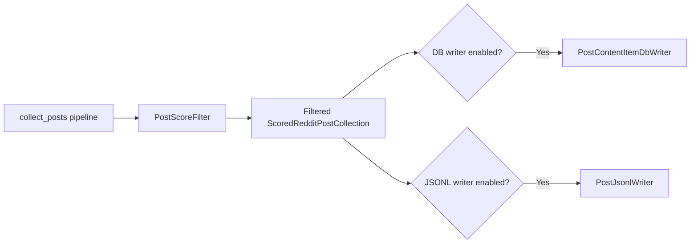

## Configurable writers for post collection

### 1. Requirement analysis

**R1. Configurable persistence.** Replace the hardcoded database-save step in `collect_posts.py` with Hydra-configured, pass-through writer stages, following the independently enabled `db_writer` and `jsonl_writer` pattern used by the paper collection scripts.

**R2. Reddit post database writer.** Add a writer for `ScoredRedditPostCollection` that persists posts as content items, including Reddit metadata, influence score, and relevance-score links. Preserve the existing identity `reddit_{submission_id}` and influence score `min(100, post.score)`. Preserve current insert behavior: if creating an existing post fails, skip it rather than updating it.

**R3. Reddit post JSONL writer.** Add a writer for `ScoredRedditPostCollection` that appends one record per post, including post metadata (the Reddit score field is named `score`), enrichment context, relevance scores, and filtering score.

**R4. Independent enablement.** Configure each writer with its own `enabled` flag. Support DB only, JSONL only, both, or neither. Both disabled means the pipeline completes without writing output. Both writers are disabled by default.

**R5. Preserve pipeline behavior.** Keep collection, filtering, enrichment, and scoring behavior unchanged. Pass the filtered collection to each enabled writer.

### 2. Tests

**T1 (R2).** Test the DB writer with a scored post and a temporary database. Verify content item ID `reddit_{submission_id}`, source type `post`, platform `reddit`, influence metric `upvotes`, post metadata, influence score `min(100, post.score)`, and relevance links with their justifications and scores.

**T2 (R2).** Run the DB writer twice with the same post. Verify the existing post is not updated and no duplicate content item is created; preserve the current skip-on-insert-failure behavior.

**T3 (R3).** Test the JSONL writer with a scored post. Verify it appends one valid JSON object containing post metadata, additional context, relevance scores, and filtering score.

**T4 (R4).** Test script wiring with both writers disabled. Verify neither writer is instantiated or called.

**T5 (R4).** Test DB-only, JSONL-only, and both-enabled configurations. Verify exactly the enabled writers are called and receive the filtered scored-post collection.

**T6 (R4).** Verify both writer configurations default to disabled.

**T7 (R5).** Verify the script passes the score-filter output, not the pre-filter scored collection, to enabled writers.

### 3. Implementation plan

#### 3.1 Implementation repos

- `mourat` (`/home/tony/reps/github/anton-pershin/mourat`)

#### 3.2 High-level design

The two writer branches are independent. Each writer is a pass-through `Function` over `ScoredRedditPostCollection`; disabled writers are not instantiated. Both are disabled by default.

#### 3.3 Todo list

1. [x] Write tests for the post DB and JSONL writers (T1–T3).
2. [x] Run the tests and confirm they fail before implementation.
3. [x] Implement Pydantic-collection-based post DB and JSONL writer stages under `mourat/writers/`.
4. [x] Add post writer configuration groups, with each writer disabled by default.
5. [x] Refactor `collect_posts.py` to pass the score-filter output to each independently enabled writer and remove the hardcoded database persistence function.
6. [x] Add script-wiring tests for disabled, DB-only, JSONL-only, both-enabled, and filtered-output cases (T4–T7).
7. [x] Run the relevant tests and applicable project checks; review the diff against this spec.

#### 3.4 Modification summary

| File | Action |
|------|--------|
| `mourat/writers/post_writers.py` | New: add DB and JSONL writers for scored Reddit posts |
| `config/db_writer/posts.yaml` | New: configure Reddit post DB writer, disabled by default |
| `config/jsonl_writer/posts.yaml` | New: configure Reddit post JSONL writer, disabled by default |
| `config/config_collect_posts.yaml` | Modified: compose writer configs and define the JSONL output path |
| `mourat/utils/config.py` | New: centralize Hydra writer enable-flag handling |
| `mourat/scripts/collect_posts.py` | Modified: replace hardcoded DB save with independently enabled writer stages and use shared config helper |
| `mourat/scripts/collect_newest_papers.py` | Modified: use shared config helper |
| `mourat/scripts/collect_influential_papers_from_scratch.py` | Modified: use shared config helper |
| `mourat/scripts/collect_influential_papers_from_seeds.py` | Modified: use shared config helper |
| `tests/test_post_writers.py` | New: test post DB and JSONL writer behavior |
| `tests/test_collect_posts_writers.py` | New: test writer enablement, default flags, and filtered collection handoff |
