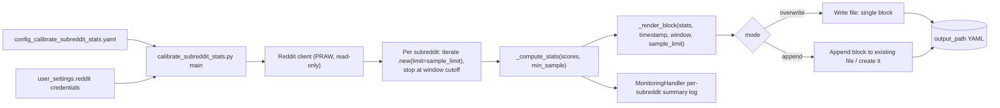

## Subreddit stats calibration

### 1. Requirement analysis

**Background.** The Reddit influence metric is currently the raw post score clipped at 100 (`min(100, post.score)` in the post DB writer). We plan to replace it with a normalized score that divides the post score by a per-subreddit reference level (e.g., the median score of the subreddit's recent posts). This reference level must be measured and supplied via config. This spec adds only the measurement tool; the consumer of its output is out of scope.

**Requirements.**

- **R1.** A standalone script `mourat/scripts/calibrate_subreddit_stats.py` runs with a Hydra config `config/config_calibrate_subreddit_stats.yaml`.
- **R2.** Config inputs:
  - `subreddits: list[str]` — subreddits to measure;
  - `time_window: dict` — kwargs for `timedelta`, e.g. `{hours: 24}` (same semantics as `RedditPostCollector`);
  - `sample_limit: int` — max posts fetched per subreddit (default 1000);
  - `min_sample: int` — minimum number of posts for a trustworthy median (default 30);
  - `output_path: str` — path of the output YAML file;
  - `mode: overwrite | append` (default `overwrite`) — overwrite the output or append a new timestamped block;
  - Reddit credentials from `user_settings.reddit` (same env vars as the collector).
- **R3.** For each subreddit: iterate `subreddit.new(limit=sample_limit)`, stop at the time-window cutoff (same iteration logic as `RedditPostCollector`), and collect `score` and `created_utc` of every post inside the window. No text-requirement filter and no per-subreddit top-K cut.
- **R4.** If the number of collected posts is below `min_sample`, record the subreddit with `insufficient: true` and its `n`; no median is computed.
- **R5.** Otherwise record per subreddit: `median` (of `score` over the windowed sample — the reference value), plus `n`, `mean`, `p10`, `p90`, `max` as diagnostics.
- **R6.** Output is a YAML file at `output_path`. On `overwrite`, replace the whole file with one block whose header comment carries the UTC timestamp, the window, and the sample limit. On `append`, add a new timestamped block to the existing file (creating it if absent).
- **R7.** The script logs a per-subreddit summary (collected count, median or `insufficient`) via the standard `MonitoringHandler`, and works with no DB and no LLM.

**Expected variants.**

- **B1.** Output file does not exist + `mode: append` → create the file with the single new block (same result as overwrite for the first run).
- **B2.** Output file exists + `mode: overwrite` → replace it entirely.
- **B3.** Output file exists + `mode: append` → keep existing content, append a new timestamped block at the end.
- **B4.** A subreddit yields fewer than `min_sample` posts → it appears with `insufficient: true`, other subreddits in the same run are unaffected.

### 2. Tests

All tests run against a fake PRAW subreddit object (a stub whose `.new(limit=...)` yields mock submissions with `created_utc` and `score`), so no network access is needed.

- **T1 (R3, R5).** A stub subreddit with 30 posts inside the window produces a record with `n=30`, `median`, `mean`, `p10`, `p90`, `max` matching statistics computed independently over the same scores (e.g., constructed scores with known values: 1..30).
- **T2 (R3).** A stub subreddit whose posts span more than the window: posts older than the cutoff are not counted (the iteration stops at the first too-old post, mirroring `RedditPostCollector`).
- **T3 (R4, B4).** A stub subreddit with fewer than `min_sample` posts (e.g., 5) records `insufficient: true` and `n=5` with no `median`; a second subreddit in the same run with enough posts still gets a full record.
- **T4 (R6, B2).** `mode: overwrite` with an existing file: after the run the file contains exactly one block with the new timestamp; the old content is gone.
- **T5 (R6, B1).** `mode: append` with no existing file: the file is created and contains one block, identical in structure to the overwrite case.
- **T6 (R6, B3).** `mode: append` with an existing file containing one block: after the run the file contains both blocks, the old one first, the new one last, each with its own timestamp header comment.
- **T7 (R5).** The median of a sample with an even count is the mean of the two middle values (e.g., scores 1..30 → median 15.5), checking that no accidental integer division truncates it.
- **T8 (R1, R2).** The Hydra config `config_calibrate_subreddit_stats.yaml` composes with the existing `user_settings` group and exposes all R2 keys with the documented defaults.

Notes on test style, consistent with the existing test suite:
- The stub is built the same way as in `tests/test_collect_posts_writers.py` — no PRAW mocking library, a plain object with the minimal attribute surface.
- The script's core computation is extracted into a testable function (e.g., `_compute_stats(scores, min_sample)` and `_render_block(...)`) so tests T1–T7 call these directly; T8 exercises the config via Hydra `compose`.

### 3. Implementation plan

#### 3.1 Implementation repos

- `anton-pershin/mourat` (management and implementation repo, degenerate case).

#### 3.2 High-level design

The script follows the pattern of the other standalone scripts (e.g., `collect_influential_papers_from_seeds.py`): `hydra.main` entry point, credentials via `user_settings.reddit`, logging via the standard `MonitoringHandler`. It contains no `Function[InputT, OutputT]` pipeline components — it is a measurement tool, not a pipeline step, so the mourat invariant does not apply to it.

Key functions in `mourat/scripts/calibrate_subreddit_stats.py`:
- `_collect_scores(subreddit, time_window, sample_limit, now_utc) -> list[int]` — windowed iteration (T1, T2);
- `_compute_stats(scores, min_sample) -> dict` — median/mean/percentiles or `insufficient` (T1, T3, T7);
- `_render_block(stats_by_subreddit, timestamp, window, sample_limit) -> str` — YAML text of one block (T4–T6);
- `_append_or_write(path, block, mode)` — file handling for B1–B3;
- `calibrate_subreddit_stats_main(cfg)` — orchestration.

#### 3.3 Todo list

1. [ ] Write the tests (`tests/test_calibrate_subreddit_stats.py`, T1–T8)
2. [ ] Run all the tests and ensure that they fail
3. [ ] Implement `_collect_scores` with the windowed-iteration logic copied from `RedditPostCollector` (no `require_text`, no top-K)
4. [ ] Implement `_compute_stats` (median, mean, p10, p90, max, `insufficient` gate)
5. [ ] Implement `_render_block` and `_append_or_write` (overwrite/append modes)
6. [ ] Implement `calibrate_subreddit_stats_main` (PRAW client, per-subreddit loop, logging via `MonitoringHandler`)
7. [ ] Add `config/config_calibrate_subreddit_stats.yaml` with the R2 keys and defaults
8. [ ] Run all the tests and ensure that they pass
9. [ ] Run the linter and the existing test suite to confirm no regressions

#### 3.4 Modification summary

| File | Action |
|------|--------|
| `mourat/scripts/calibrate_subreddit_stats.py` | New |
| `tests/test_calibrate_subreddit_stats.py` | New |
| `config/config_calibrate_subreddit_stats.yaml` | New |

No existing files are modified.

Notes: p10/p90 are computed with a simple nearest-rank method on the sorted scores (no numpy dependency — the project's other scripts avoid heavy deps in scripts).
