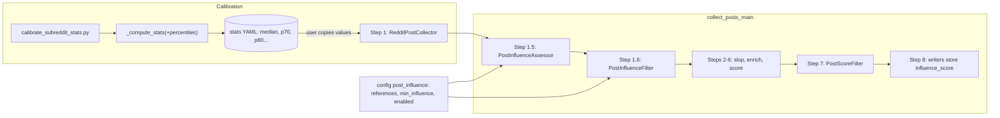

## Normalized post influence score

### 1. Requirement analysis

**Background.** The Reddit influence score is currently the raw post score clipped at 100 (`min(100, post.score)` in the post DB writer). We replace it with a normalized score comparing each post against a per-subreddit reference level, measured out-of-band by the calibration script from spec 16 and supplied via config. Posts whose normalized influence falls below a threshold are dropped **immediately after collection**, so no LLM work is spent on them. This spec covers both the calibration script extension (configurable percentiles) and the pipeline changes.

**Part A — calibration script extension.**

- **R1.** `config/config_calibrate_subreddit_stats.yaml` gains an optional key `percentiles: list[float]` (e.g. `[0.7, 0.8]`); values in `[0, 1]`. Default: empty (backward compatible).
- **R2.** For each percentile `p`, `_compute_stats` additionally records key `p{int(p*100)}` (e.g. `p70`, `p80`) computed with the same nearest-rank method as `p10`/`p90`. Records for insufficient samples stay unchanged.

**Part B — normalized influence in the pipeline.**

- **R3.** New config group `post_influence` (used by `config_collect_posts.yaml`) with:
  - `references: map[subreddit -> reference level]` — per-subreddit reference values, filled by the user from calibration output;
  - `min_influence: int` (default `50`) — posts below it are dropped;
  - `enabled: bool` (default `true`) — when `false`, no influence filtering and the writers fall back to the current `min(100, post.score)` behavior.
- **R4.** Two new pipeline steps in `collect_posts_main`, placed **between collection (step 1) and the slop filters (step 2)**:
  - `PostInfluenceAssessor` (`Function[RedditPostCollection, RedditPostCollection]`): computes for each post

    ```
    ratio = post.score / max(reference, 1)
    influence_score = round(100 * ratio / (ratio + 1))    # 0 → 0, at reference → 50, ∞ → 100
    ```

    and writes it onto the post (`RedditPostInfo` gains `influence_score: int | None`).
  - `PostInfluenceFilter` (`Function[RedditPostCollection, RedditPostCollection]`): drops posts with `influence_score < min_influence` (same drop-accounting logging as the other filters).
- **R5.** If a post's subreddit is absent from `references` (and `enabled: true`), the assessor raises an exception naming the subreddit (loud failure; the user must add the subreddit to the mapping or disable the feature).
- **R6.** The influence score travels through the pipeline: when posts become `ScoredRedditPost` at scoring time, `influence_score` is carried over from the underlying `RedditPostInfo`.
- **R7.** The post DB writer stores `post.post.influence_score` and the JSONL writer includes it in each record. When `influence_score` is `None` (only possible with `enabled: false`), both writers store the legacy `min(100, post.score)`, preserving today's behavior.
- **R8.** The collector's per-subreddit top-K cut, the relevance scorer, and all thresholds remain unchanged. `scoring.min_score` stays in raw relevance units. The early influence filter is a second, independent selection stage — it does not replace top-K.

**Expected variants.**

- **B1.** `enabled: false` → pipeline behaves exactly as today (no influence step, no filtering, legacy clipped score stored).
- **B2.** `enabled: true` + subreddit present in `references` → normalized score computed; posts below `min_influence` dropped right after collection; surviving posts carry the score to the writers.
- **B3.** `enabled: true` + subreddit absent from `references` → exception naming the subreddit; the run fails loudly before any LLM work.
- **B4.** `references` empty or `percentiles` unset → valid configs: percentiles default off (R1), and with `enabled: true` an empty `references` means the first collected post triggers R5's exception.

**Note.** The influence-score formula is an implementation detail of the assessor and may change in the future; the pipeline structure (assessor → filter placement after collection, config group, score travel, writer behavior) stays as specified here regardless of the formula.

### 2. Tests

**Part A (calibration script extension).**

- **T1 (R1, R2).** `_compute_stats(scores, min_sample, percentiles=[0.7, 0.8])` on scores 1..100: keys `p70` and `p80` present, matching nearest-rank values computed independently (70th and 80th smallest). Existing keys (`n`, `median`, `mean`, `p10`, `p90`, `max`) unchanged.
- **T2 (R1).** Default `percentiles=[]` produces exactly the spec-16 keys — no `pXX` keys added (backward compatibility).
- **T3 (R2).** Insufficient sample + `percentiles=[0.7]` still returns `{"insufficient": True, "n": ...}` with no percentile keys.
- **T4 (R1).** The calibration config gains `percentiles: []` default and composes (Hydra `compose`).

**Part B (pipeline).**

- **T5 (R4).** `PostInfluenceAssessor` on a `RedditPostCollection` with known raw scores and references: score equal to reference → 50; score 0 → 0; score 9× reference → 90; rounding verified on a non-integer case (ratio 1/3 → 25). Output is a `RedditPostCollection`; `score`, `title`, text etc. unchanged.
- **T6 (R4).** `reference` below 1 (e.g. 0.5): the `max(reference, 1)` guard applies — a post with score 1 scores 50.
- **T7 (R5, B3).** A post whose subreddit is absent from `references` → the assessor raises an exception whose message names the subreddit.
- **T8 (R4).** `PostInfluenceFilter` with `min_influence=50`: a collection with scores 49, 50, 51 → the 49 post is dropped, 50 and 51 survive; drop count logged.
- **T9 (R6).** `PostContentItemScorer` (or the scoring binding) carries `influence_score` from `RedditPostInfo` onto `ScoredRedditPost` unchanged.
- **T10 (R7, B2).** DB writer with a post carrying `influence_score=73` stores 73 in `content_items` (not the clip); JSONL record contains 73.
- **T11 (R7, B1).** Writers with a post carrying `influence_score=None` store `min(100, post.score)` — legacy behavior preserved.
- **T12 (R3, R8, B4).** `config_collect_posts.yaml` composes with the new `post_influence` group (`references: {}`, `min_influence: 50`, `enabled: true`); resolved config keys are a superset of the pre-spec config (only additions).
- **T13 (R4, B2).** Placement/behavior integration: running assessor → filter on a collected collection with `enabled: true` and `min_influence=50` yields exactly the posts at or above their subreddit reference; with `enabled: false` the collection passes through unchanged with all `influence_score=None`.

Test style notes: Part B tests build `RedditPostInfo`/`ScoredRedditPost` objects directly (fixtures like in `tests/test_post_writers.py`); no PRAW, no LLM, no network. Assessor/filter tests instantiate the Functions with a monitoring handler stub, as other processor tests do.

### 3. Implementation plan

#### 3.1 Implementation repos

- `anton-pershin/mourat` (management and implementation repo, degenerate case).

#### 3.2 High-level design



Components:
- `mourat/processors/post_influence.py` — `PostInfluenceAssessor(Function[RedditPostCollection, RedditPostCollection])` and `PostInfluenceFilter(Function[RedditPostCollection, RedditPostCollection])`; the formula lives in a module-level function `compute_influence_score(score, reference)` so a future change touches one function.
- `RedditPostInfo` gains `influence_score: int | None = None`; `ScoredRedditPost` gains the same; `PostContentItemScorer` copies it across.
- Writers: DB writer stores `post.post.influence_score if not None else min(100, post.score)`; JSONL adds the field.
- `collect_posts_main`: with `post_influence.enabled`, insert steps 1.5/1.6 (numbering keeps the existing step ids stable); logging via the existing `_log_post_counts` helper.
- Config: `config_calibrate_subreddit_stats.yaml` gains `percentiles: []`; `config_collect_posts.yaml` gains the `post_influence` group.

#### 3.3 Todo list

1. [ ] Write the tests (T1–T13: extend `tests/test_calibrate_subreddit_stats.py`, add `tests/test_post_influence.py`, extend writer/scorer/config tests)
2. [ ] Run all the tests and ensure that they fail
3. [ ] Part A: add `percentiles` to the calibration script and its config
4. [ ] Add `influence_score` to `RedditPostInfo` and `ScoredRedditPost`
5. [ ] Implement `PostInfluenceAssessor` and `PostInfluenceFilter`
6. [ ] Wire steps 1.5/1.6 into `collect_posts_main` behind `post_influence.enabled`; carry the score through the scorer binding
7. [ ] Update both writers (normalized value or legacy clip)
8. [ ] Update both configs
9. [ ] Run all the tests and ensure that they pass
10. [ ] Run black and the full test suite to confirm no regressions

#### 3.4 Modification summary

| File | Action |
|------|--------|
| `mourat/processors/post_influence.py` | New |
| `tests/test_post_influence.py` | New |
| `mourat/data_models.py` | Modified: `influence_score` field on `RedditPostInfo` and `ScoredRedditPost` |
| `mourat/scripts/calibrate_subreddit_stats.py` | Modified: `percentiles` parameter in `_compute_stats` and config plumbing |
| `mourat/scripts/collect_posts.py` | Modified: steps 1.5/1.6 wiring |
| `mourat/processors/content_item_scorer.py` | Modified: carry `influence_score` in the post binding |
| `mourat/writers/post_writers.py` | Modified: both writers |
| `tests/test_calibrate_subreddit_stats.py` | Modified: T1–T4 |
| `tests/test_post_writers.py` / `tests/test_collect_posts_writers.py` | Modified: T10, T11 |
| `config/config_calibrate_subreddit_stats.yaml` | Modified: `percentiles: []` |
| `config/config_collect_posts.yaml` | Modified: `post_influence` group |
